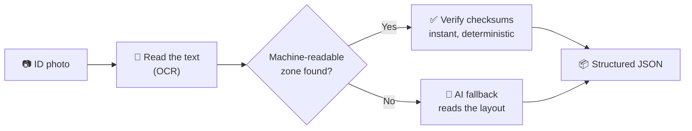
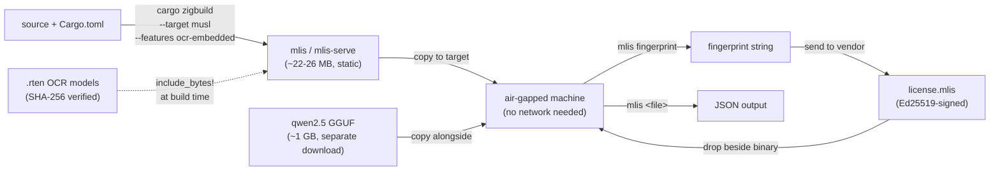

# 🪪 multi-level-id-strip (mlis)

<!-- Language / backend -->


<!-- ML / inference -->


<!-- OCR / runtime -->

<!-- MRZ / demo -->


[](https://ruledicaprio.github.io/multi-level-id-strip/)
<!-- Posture -->


Air-gapped document extraction: passports and ID cards in — structured JSON out, with **zero cloud calls**. A shared Rust pipeline OCRs the input, validates identity documents **deterministically via ICAO 9303 MRZ check digits** (Tier 1), and only falls back to a quantized Qwen 2.5 GGUF model (Tier 2) when no valid MRZ exists. Full version-by-version history lives in [CHANGELOG.md](CHANGELOG.md); architecture rationale in [docs/ARCHITECTURE.md](docs/ARCHITECTURE.md).

## ✨ Features

- **Zero cloud calls.** OCR and LLM inference both run in-process on your machine — no PII ever leaves it, in the CLI, the web app, or the browser demo.
- **Deterministic first (Tier 1).** ICAO 9303 MRZ check digits (7-3-1 weighting) mathematically prove a faithful read for any document with a machine-readable zone — no model, no hallucination risk, and it's tried before the LLM on every document.
- **LLM fallback (Tier 2), only when needed.** When no valid MRZ exists, a quantized Qwen 2.5 1.5B model (in-process, CPU-only) fills the same extraction schema — see the [accuracy caveats](#-in-process-llm-fallback-tier-2-v060) stated plainly, not oversold.
- **No Docker, no Python, no sidecars.** OCR ([`mlis-ocr`](crates/mlis-ocr/), pure-Rust `ocrs`/`rten`) and Tier-2 inference ([`mlis-llm`](crates/mlis-llm/), `llama-cpp-2`) both run inside the same binary, unchanged on Windows/macOS/Linux.
- **Image formats:** JPEG, PNG, WebP, TIFF, BMP, GIF. (PDF and HEIC/HEIF aren't supported — see [why](docs/ARCHITECTURE.md#8-known-limitations--what-tier-2-accuracy-actually-looks-like).)
- **Offline, Ed25519-signed licensing.** Extraction is meterable and sellable without the binary ever phoning home — see [Licensing](#-licensing-v080).
- **Single static binary (v1.0.0).** `mlis`/`mlis-serve` also build as one statically-linked `x86_64-unknown-linux-musl` file with the OCR models baked in — see [Static musl release](#-static-musl-release-v100).
- **Three ways to run it:** the CLI, a self-hostable Axum web app, or the [**browser-only MRZ demo**](https://ruledicaprio.github.io/multi-level-id-strip/) — Rust compiled to WebAssembly with a self-hosted, zero-CDN OCR runtime, no server at all.

## 🖼️ See it work


```
$ mlis Croatian_passport_data_page.jpg
✔ SPECIMEN SPECIMEN · HRV passport 007007007 · verified in <1s, LLM never ran
```

That's a real run against the public-domain specimen above (from [`samples/`](samples/)):
every ICAO 9303 check digit on the printed MRZ verified mathematically, so the deterministic
**Tier 1** path handled it end-to-end — no LLM call, no guessing.

<details>
<summary>Full JSON output</summary>

```json
{
  "document_type": "P",
  "issuing_country": "HRV",
  "issuing_country_name": "Croatia",
  "document_number": "007007007",
  "surname": "SPECIMEN",
  "given_names": "SPECIMEN",
  "nationality": "HRV",
  "nationality_name": "Croatia",
  "date_of_birth": "1982-12-25",
  "sex": "F",
  "date_of_expiry": "2014-07-01",
  "mrz_line": "P<HRVSPECIMEN<<SPECIMEN<<<<<<<<<<<<<<<<<<<<<\n0070070071HRV8212258F1407019<<<<<<<<<<<<<<06",
  "mrz_checksums_valid": true,
  "validity": { "dates_well_formed": true, "in_date": false, "dob_before_expiry": true },
  "extraction_method": "mrz-deterministic"
}
```

`in_date: false` — the specimen expired in 2014 (the live output also carries an exact
`days_until_expiry`). A valid composite check digit proves a faithful **read** of the printed
zone; whether the document is *in date* is a separate, non-cryptographic judgement.

</details>

**[Try it yourself, live →](https://ruledicaprio.github.io/multi-level-id-strip/)** Same Rust
code, compiled to WebAssembly, running in your browser tab — no install, no upload to any
server. Snap or upload a photo and watch the fields fill in; the result is shown for 10 seconds
with a copy button, then wiped. **No data is ever persistent — there is no server.**

## 📚 Contents

- [How it works](#-how-it-works)
- [Deterministic MRZ validation (Tier 1)](#-deterministic-mrz-validation-tier-1)
- [In-process LLM fallback (Tier 2)](#-in-process-llm-fallback-tier-2-v060)
- [Quickstart](#-quickstart)
- [Configuration](#-configuration)
- [Licensing](#-licensing-v080)
- [Static musl release](#-static-musl-release-v100)
- [Repository Layout](#-repository-layout)
- [Security](#-security-tier-3)
- [Acknowledgments](#-acknowledgments)
- [License](#-license)

## 🔀 How it works



Every document is checked against its own printed math first (Tier 1) — that's what makes the
green path instant and provably correct, not just "probably right." The AI model (Tier 2) only
runs on the documents that need it. Both stages run **in the same process**, on your machine —
no Docker, no Python, no network call, on Windows/macOS/Linux alike. Full engineering detail
(the pluggable trait boundary, what got deleted along the way, why) is in
[docs/ARCHITECTURE.md](docs/ARCHITECTURE.md).

## 🔐 Deterministic MRZ validation (Tier 1)

The [`mrz`](crates/mrz/) crate is a zero-dependency ICAO 9303 parser: TD1/TD2/TD3, every check digit verified (7-3-1 weighting), with **checksum-verified OCR repair** — common misreads (`B`↔`8`, `O`↔`0`, filler runs read as `K`/`L`, dropped or hallucinated characters) are corrected by generating candidate readings and letting the composite check digit prove which one matches the printed zone. A valid composite is mathematical proof of a faithful read; a failed one flags a bad scan or a tampered document. When Tier 1 validates, the LLM never runs: extraction is instant, deterministic and hallucination-free.

> **Date validity ≠ authenticity.** A valid MRZ checksum and self-consistent dates prove the extraction faithfully matches what's printed on the document — not that the document itself is genuine or unaltered. This is an OCR/data-integrity tool, not a forgery-detection tool.

## 🧠 In-process LLM fallback (Tier 2, v0.6.0)

When no valid MRZ exists, Tier 2 asks a quantized Qwen 2.5 1.5B model to read the OCR Markdown and fill the same [`Extraction`](crates/mlis-core/src/lib.rs) schema Tier 1 produces. That model runs **in the same process** as the CLI or web server — [`mlis-llm`](crates/mlis-llm/) loads the GGUF once via [`llama-cpp-2`](https://crates.io/crates/llama-cpp-2), verifies its SHA-256 against a known-good hash before first use, and keeps it warm for the process lifetime. There's no sidecar to start, no gRPC port to open, and (as of v0.7.5) no Python anywhere in this codebase at all.

This is explicitly a probabilistic fallback, not a second source of truth: a 1.5B model reading garbled OCR of a document it's never seen the layout for will not match a deterministic checksum for accuracy, and the field-level parity harness (`crates/mlis-llm/tests/parity.rs`) exists to catch regressions in that fallback quality, not to promise perfection. That asymmetry is *why* Tier 1 exists and is tried first on every document.

## 🚀 Quickstart

No Docker or Python required to *run* mlis — both OCR and Tier 2 run in-process. Image input only (JPEG, PNG,
WebP, TIFF, BMP, GIF) — PDF and HEIC/HEIF are not supported; see [docs/ARCHITECTURE.md](docs/ARCHITECTURE.md#8-known-limitations--what-tier-2-accuracy-actually-looks-like) for why. Extraction needs a license — see [Licensing](#-licensing-v080) below, or set `MLIS_LICENSE_SKIP=1` while developing.

> **Windows, building from source:** Tier 2 (`llama-cpp-2`) compiles `llama.cpp`'s C++ code and
> needs CMake + LLVM/libclang + MSVC Build Tools installed — a much heavier ask than plain Rust.
> If step 2 below fails with a `llama-cpp-sys-2` build error, that's this, not a broken clone.
> The reproducible fix without installing anything system-wide is a Linux container — see
> [CONTRIBUTING.md](CONTRIBUTING.md#building--testing) — swap `cargo run -p ...` below for the
> same command run inside it.

Clone to running, start to finish:

```powershell
git clone https://github.com/ruledicaprio/multi-level-id-strip.git
cd multi-level-id-strip

# 1. Download the Tier-2 model (~1 GB, not tracked in git).
curl -L -o qwen2.5-1.5b-instruct-q4_k_m.gguf `
  https://huggingface.co/Qwen/Qwen2.5-1.5B-Instruct-GGUF/resolve/main/qwen2.5-1.5b-instruct-q4_k_m.gguf
# The two OCR .rten weight files (~12 MB total) download + SHA-256-verify
# automatically on first run — no manual step needed for those.

# 2. Preflight: checks OCR/inferer/license and config before a real run.
cargo run -p mlis-cli -- doctor

# 3. Extract a document (skip the license gate for local dev/testing).
$env:MLIS_LICENSE_SKIP = "1"
cargo run -p mlis-cli -- samples/Croatian_passport_data_page.jpg

# 4. ...or run the web app instead — upload page + JSON API on http://127.0.0.1:8080
cargo run -p mlis-serve
```

```powershell
# API example (against mlis-serve from step 4):
curl -F "file=@samples/Passport_of_Serbia_ID_2009_version.jpg" http://127.0.0.1:8080/api/extract
```

## ⚙️ Configuration

| Variable | Default | Purpose |
| --- | --- | --- |
| `MLIS_OCR_ENGINE` | `rust` | `rust` is the only engine since v1.2.0 (any other value warns and falls back) |
| `MLIS_OCR_MODEL_DIR` | `.` (repo root) | directory holding `text-detection.rten` / `text-recognition.rten`, `rust` engine only |
| `MLIS_OCR_DETECTION_SHA256` / `MLIS_OCR_RECOGNITION_SHA256` | *(built-in hash)* | override the expected checksums, `rust` engine only |
| `MLIS_OCR_MODEL_SKIP_VERIFY` | *(unset)* | skip the `rust` engine's model checksum verification |
| `MLIS_OCR_AUTO_DOWNLOAD` | `1` | `rust` engine: fetch missing `.rten` files automatically; `0` requires pre-staged files |
| `MLIS_MODEL_PATH` | `./qwen2.5-1.5b-instruct-q4_k_m.gguf` | GGUF path |
| `MLIS_MODEL_N_CTX` | `2048` | context window (tokens) |
| `MLIS_MODEL_SHA256` / `MLIS_MODEL_SKIP_VERIFY` | *(built-in hash)* / *(unset)* | override the expected model checksum, or skip verification |
| `MLIS_MAX_QUEUE_DEPTH` | `4` | `mlis-serve`: reject uploads with 503 once this many Tier-2 requests are queued/in-flight |
| `MLIS_TOKEN` | *(unset)* | require `Authorization: Bearer <token>`; **mandatory for non-loopback `BIND_ADDR`** |
| `MLIS_TLS_CERT` / `MLIS_TLS_KEY` | *(unset)* | enable rustls TLS on `mlis-serve` |
| `MLIS_AUDIT_LOG` | *(unset)* | append PII-free SHA-256 audit records (JSONL) |
| `MLIS_KEY` | *(unset)* | base64 32-byte AES-256 key → encrypt output to `<input>.json.enc` (`mlis decrypt` to read) |
| `MLIS_LICENSE_PATH` | `license.mlis` | path to the signed license file |
| `MLIS_LICENSE_SKIP` | *(unset)* | `1` bypasses license enforcement entirely (local development/CI) |
| `MLIS_LICENSE_PUBKEY` | *(embedded)* | override the embedded verifying key (base64), for testing |

> **Windows note:** the native Tier-2 backend needs CMake + LLVM/libclang + MSVC to build `llama-cpp-2`'s bundled `llama.cpp` (see `crates/mlis-llm`). The OCR engine (`mlis-ocr`, `ocrs`/`rten`) needs no native toolchain at all and works unchanged on Windows.
>
> **OCR accuracy note (v1.1.0):** Tier-1 extraction hits **6/6 (100%)** of the MRZ-bearing specimens in [`samples/`](samples/) (down to a 360×225 ID-card rear), with zero false positives on the no-MRZ control images — measured by the corpus harness at [`crates/mlis-ocr/examples/mrz_corpus.rs`](crates/mlis-ocr/examples/mrz_corpus.rs). When the general OCR pass can't produce a checksum-valid MRZ, targeted retry passes (MRZ-charset-constrained recognition over preprocessed crops) run automatically; the ICAO check digits decide which reading — if any — is trusted. When Tier 1 still misses, Tier 2 runs as usual.

## 🔑 Licensing (v0.8.0)

Extraction requires an offline, Ed25519-signed license — set once and checked with no network
call. For local development, skip enforcement entirely:
```powershell
$env:MLIS_LICENSE_SKIP = "1"
```
Full customer (`fingerprint` → `verify-license`) and vendor (`keygen` → `issue-license`) CLI
walkthroughs live in **[docs/LICENSING.md](docs/LICENSING.md)**. Design rationale — signed-bytes
format, `verify_strict`, the fingerprint scheme, and the threat model stated plainly — is in
[docs/ARCHITECTURE.md §6](docs/ARCHITECTURE.md#6-offline-cryptographic-licensing-v080).

## 📦 Static musl release (v1.0.0)

For a true "copy one file to an air-gapped machine" deployment, `mlis`/`mlis-serve` also build as
single, statically-linked `x86_64-unknown-linux-musl` binaries with the OCR models baked in — no
Docker, no runtime network access, no shared libraries to install on the target machine.

```bash
# Build (needs the musl target + Zig + cargo-zigbuild — see docker/Dockerfile.builder,
# or CONTRIBUTING.md's "Cross-compiling to musl locally" section):
cargo zigbuild --release --target x86_64-unknown-linux-musl -p mlis-cli -p mlis-serve \
  --features ocr-embedded

file target/x86_64-unknown-linux-musl/release/mlis   # → "statically linked, stripped"
```



Deploy: copy `mlis`, `mlis-serve`, and the separately-downloaded GGUF model onto the target
machine, run `mlis fingerprint` to get an identifier, obtain a license bound to it, drop
`license.mlis` beside the binary, then run `mlis <file>` — no further setup. See
[docs/ARCHITECTURE.md §10](docs/ARCHITECTURE.md#10-v100-and-beyond)
for the full toolchain rationale (why Zig over `cross-rs`/manual `musl-gcc`) and known
limitations. `docker/Dockerfile.musl` packages the same binaries into a minimal `FROM scratch`
image, if you'd rather run it in a container than as a raw binary.

## 📁 Repository Layout

```
├── crates/
│   ├── mrz/           Zero-dep ICAO 9303 engine: TD1/TD2/TD3, checksum-verified OCR
│   │                  repair, date-plausibility, ISO/ICAO country names
│   ├── mrz-wasm/      wasm-bindgen wrapper for the browser demo
│   ├── mlis-core/     Canonical Extraction schema + Tier-3 audit/crypto helpers
│   ├── mlis-llm/      In-process Tier-2 inference: Qwen GGUF via `llama-cpp-2`, ChatML
│   │                  prompting, JSON repair, model integrity check
│   ├── mlis-ocr/      In-process pure-Rust OCR: ocrs/rten, model download + integrity check
│   ├── mlis-license/  Offline licensing: Ed25519 sign/verify, fingerprint, vendor issuer binary
│   │                  (`vendor` feature; keygen + issue-license, never shipped to customers)
│   ├── mlis-pipeline/ OcrEngine trait (rust | native) → Tier 1 MRZ → Tier 2
│   │                  InferBackend (native) → JSON. Image-only, license-agnostic.
│   ├── mlis-cli/      CLI front-end (binary `mlis`; also `decrypt`/`fingerprint`/`verify-license`)
│   └── mlis-serve/    axum web app: upload page + POST /api/extract (SSE progress on Tier 2),
│                      bearer auth + TLS + license enforcement
├── docker/           Optional container packaging: Dockerfile.serve + docker-compose.yml
│                     for `mlis-serve` — not required for any functional code path
├── web/              GitHub Pages demo site (static, client-side only)
├── samples/          Public-domain specimen documents + example outputs
└── docs/             Architectural manifest, licensing walkthrough & roadmap
```

## 🔒 Security (Tier 3)

Everything runs on loopback by default. `mlis-serve` **refuses a non-loopback bind unless `MLIS_TOKEN` is set**, then enforces `Authorization: Bearer <token>` on every request; set `MLIS_TLS_CERT`/`MLIS_TLS_KEY` for rustls TLS. Uploaded files and intermediate artifacts are deleted after each request. Two optional at-rest controls: `MLIS_AUDIT_LOG` appends a **PII-free** SHA-256 audit trail (fingerprint + method + timestamp, no names/numbers), and `MLIS_KEY` (base64 32-byte AES-256) encrypts the output JSON to `<input>.json.enc` — decrypt with `mlis decrypt`. The native Tier-2 model itself is SHA-256-verified before use, so a tampered or substituted GGUF fails closed rather than running silently. As of **v0.9.0**, the highest-value in-memory PII carriers (the extracted fields, the AES key, the raw Tier-2 output) are wiped on drop (`zeroize`, best-effort — see [docs/ARCHITECTURE.md](docs/ARCHITECTURE.md) §7 for exactly what is and isn't covered), and the untrusted OCR ingest path is fuzz-tested — an always-on `proptest` suite plus opt-in `cargo-fuzz` coverage (`cargo fuzz run mrz_find_and_parse` / `mrz_parse_td` from `fuzz/`). Full rationale in [docs/ARCHITECTURE.md](docs/ARCHITECTURE.md).

## 🙏 Acknowledgments

A solo-authored project where the ideas, architecture and direction are the human's; the execution was AI-accelerated.

- **Rusmir Skopljak** ([@ruledicaprio](https://github.com/ruledicaprio)) — creator, author, architecture & direction
- **Claude Opus 4.8 / Sonnet 5** (Anthropic) — orchestration & implementation
- **DeepSeek v4 Pro** — advisory / architectural review

Copyright and authorship rest with the human author; the AI tools are credited as assistants, not legal authors.

## 📜 License

[MIT](LICENSE) © Rusmir Skopljak. Bundled third-party licenses are in [THIRD_PARTY_NOTICES.md](THIRD_PARTY_NOTICES.md); the security policy is in [SECURITY.md](SECURITY.md). The MRZ demo's OCR-B model (`web/tessdata/mrz.traineddata`) is © [DoubangoTelecom](https://github.com/DoubangoTelecom/tesseractMRZ), BSD-3-Clause.
