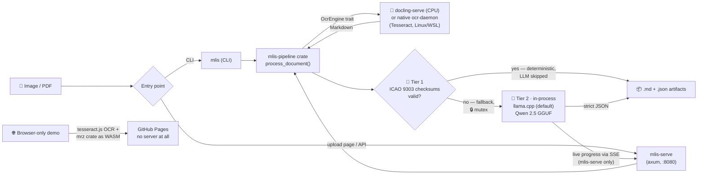

# 🪪 multi-level-id-strip (mlis)

<!-- Language / backend -->


<!-- ML / inference -->


<!-- OCR / runtime -->


<!-- MRZ / demo -->


[](https://ruledicaprio.github.io/multi-level-id-strip/)
<!-- Posture -->


Air-gapped document extraction: passports and ID cards in — structured JSON out, with **zero cloud calls**. A shared Rust pipeline ships files to a local `docling-serve` OCR container (CPU), validates identity documents **deterministically via ICAO 9303 MRZ check digits** (Tier 1), and only falls back to a quantized Qwen 2.5 GGUF model (GPU, Tier 2) when no valid MRZ exists — which also catches other unstructured scans, though there's no dedicated extraction schema for them yet (see [docs/ARCHITECTURE.md](docs/ARCHITECTURE.md)). Use it from the CLI, a self-hostable axum web app, or the [**browser-only MRZ demo**](https://ruledicaprio.github.io/multi-level-id-strip/) — no PII ever leaves your machine.

## 🔀 Pipeline



CPU handles OCR, GPU handles LLM inference — a deliberate split that keeps a 3.5 GB-VRAM card (GTX 970) from OOM-ing. Full rationale in [docs/ARCHITECTURE.md](docs/ARCHITECTURE.md).

## 🖼️ Example

A public-domain Croatian passport specimen (from [`samples/`](samples/)) → deterministic **Tier 1** extraction, with every ICAO 9303 check digit verified. The LLM never runs:


```json
{
  "document_type": "P",
  "issuing_country": "HRV",
  "issuing_country_name": "Croatia",
  "document_number": "007007007",
  "surname": "SPECIMEN",
  "given_names": "SPECIMEN",
  "nationality": "HRV",
  "nationality_name": "Croatia",
  "date_of_birth": "1982-12-25",
  "sex": "F",
  "date_of_expiry": "2014-07-01",
  "mrz_line": "P<HRVSPECIMEN<<SPECIMEN<<<<<<<<<<<<<<<<<<<<<\n0070070071HRV8212258F1407019<<<<<<<<<<<<<<06",
  "mrz_checksums_valid": true,
  "validity": { "dates_well_formed": true, "in_date": false, "dob_before_expiry": true },
  "extraction_method": "mrz-deterministic"
}
```

> `in_date: false` — the specimen expired in 2014 (the live output also carries an exact `days_until_expiry`). A valid composite check digit proves a faithful **read** of the printed zone; whether the document is *in date* is a separate, non-cryptographic judgement.

## 🔐 Deterministic MRZ validation (Tier 1)

The [`mrz`](crates/mrz/) crate is a zero-dependency ICAO 9303 parser: TD3 passports and TD1 ID cards, every check digit verified (7-3-1 weighting), with **checksum-verified OCR repair** — common misreads (`B`↔`8`, `O`↔`0`, filler runs read as `K`/`L`, dropped or hallucinated characters) are corrected by generating candidate readings and letting the composite check digit prove which one matches the printed zone. A valid composite is mathematical proof of a faithful read; a failed one flags a bad scan or a tampered document. When Tier 1 validates, the LLM never runs: extraction is instant, deterministic and hallucination-free.

> **Date validity ≠ authenticity.** A valid MRZ checksum and self-consistent dates prove the extraction faithfully matches what's printed on the document — not that the document itself is genuine or unaltered. This is an OCR/data-integrity tool, not a forgery-detection tool.

**[Try the live demo →](https://ruledicaprio.github.io/multi-level-id-strip/)** The same Rust code compiled to WebAssembly, with tesseract.js OCR, on a static GitHub Pages site. **No data is persistent on any server — there is no server.** Images are downscaled and processed entirely inside your browser tab; the extracted JSON is shown for 10 seconds with a copy button, then wiped.

## 🚀 Quickstart

**1. Start the OCR engine** (Docker):
```powershell
docker run -d --name docling-serve -p 5001:5001 `
  -e OMP_NUM_THREADS=4 -e MKL_NUM_THREADS=4 `
  ghcr.io/docling-project/docling-serve
```

**2. Download the model** (~1 GB, not tracked in git; the Docker path in step 4 downloads it automatically):
```powershell
curl -L -o qwen2.5-1.5b-instruct-q4_k_m.gguf `
  https://huggingface.co/Qwen/Qwen2.5-1.5B-Instruct-GGUF/resolve/main/qwen2.5-1.5b-instruct-q4_k_m.gguf
```

**3. Run** (from the repo root — Tier 2 runs the GGUF **in-process** by default, no separate inferer process to start):
```powershell
# Preflight: checks OCR/inferer reachability and config before a real run
cargo run -p mlis-cli -- doctor

# CLI — one-shot extraction (binary `mlis`):
cargo run -p mlis-cli -- samples/Croatian_passport_data_page.jpg

# Web app — upload page + JSON API on http://127.0.0.1:8080
cargo run -p mlis-serve
```

```powershell
# API example:
curl -F "file=@samples/Passport_of_Serbia_ID_2009_version.jpg" http://127.0.0.1:8080/api/extract
```

**4. Or bring the whole stack up with Docker:** `docker compose -f docker/docker-compose.yml up`
(OCR + web app; the `inferer` sidecar container auto-downloads and checksum-verifies the GGUF into
`models/` on first start. The compose file pins `MLIS_INFERER=grpc` on `serve` for this release —
drop that env var to use the in-process native backend there too, once you've dropped the `inferer`
service.)

<details>
<summary><b>Legacy: the Python gRPC sidecar</b> (feature <code>inferer-grpc</code>, kept as a fallback for one release)</summary>

```powershell
python -m venv .venv
.\.venv\Scripts\Activate.ps1
pip install ./python                             # CPU-only (grpcio, pydantic, llama-cpp-python)
# or, with NVIDIA GPU acceleration (prebuilt CUDA 12.4 wheel):
pip install llama-cpp-python --extra-index-url https://abetlen.github.io/llama-cpp-python/whl/cu124

cd python; python generate_grpc.py; python -m inferer; cd ..   # serves gRPC on :50051
```
Then set `MLIS_INFERER=grpc` (and `MLIS_INFERER_ADDR` if not on `127.0.0.1:50051`) before running the
CLI or `mlis-serve`.
</details>

### Configuration (environment)

| Variable | Default | Purpose |
| --- | --- | --- |
| `MLIS_OCR_ENGINE` | `docling` | `docling` (all platforms) or `native` (Linux/WSL Tesseract, `--features native-ocr`) |
| `DOCLING_URL` | `http://localhost:5001` | docling-serve OCR endpoint |
| `MLIS_INFERER` | `native` | Tier-2 backend: `native` (in-process llama.cpp, default) or `grpc` (legacy Python sidecar) |
| `MLIS_MODEL_PATH` | `./qwen2.5-1.5b-instruct-q4_k_m.gguf` | GGUF path, `native` backend only |
| `MLIS_MODEL_SHA256` / `MLIS_MODEL_SKIP_VERIFY` | *(built-in hash)* / *(unset)* | override the expected model checksum, or skip verification |
| `MLIS_INFERER_ADDR` | `http://127.0.0.1:50051` | gRPC inferer endpoint, `grpc` backend only |
| `MLIS_MAX_QUEUE_DEPTH` | `4` | `mlis-serve`: reject uploads with 503 once this many Tier-2 requests are queued/in-flight |
| `MLIS_TOKEN` | *(unset)* | require `Authorization: Bearer <token>`; **mandatory for non-loopback `BIND_ADDR`** |
| `MLIS_TLS_CERT` / `MLIS_TLS_KEY` | *(unset)* | enable rustls TLS on `mlis-serve` |
| `MLIS_AUDIT_LOG` | *(unset)* | append PII-free SHA-256 audit records (JSONL) |
| `MLIS_KEY` | *(unset)* | base64 32-byte AES-256 key → encrypt output to `<input>.json.enc` (`mlis decrypt` to read) |

> **Windows note:** the native Tier-2 backend needs CMake + LLVM/libclang + MSVC to build `llama-cpp-2`'s bundled `llama.cpp` (see `crates/mlis-llm`). The native OCR engine (`ocr-daemon`) is Linux/WSL-only.

## 📁 Repository Layout

```
├── crates/
│   ├── mrz/           Zero-dep ICAO 9303 engine: TD1/TD2/TD3, checksum-verified OCR
│   │                  repair, date-plausibility, ISO/ICAO country names
│   ├── mrz-wasm/      wasm-bindgen wrapper for the browser demo
│   ├── mlis-core/     Canonical Extraction schema + Tier-3 audit/crypto helpers
│   ├── mlis-llm/      In-process Tier-2 inference: Qwen GGUF via `llama-cpp-2`, ChatML
│   │                  prompting, JSON repair, model integrity check
│   ├── mlis-pipeline/ OCR engine trait → Tier 1 MRZ → Tier 2 InferBackend (native | gRPC) → JSON
│   ├── mlis-cli/      CLI front-end (binary `mlis`; also `mlis decrypt`)
│   ├── mlis-serve/    axum web app: upload page + POST /api/extract (SSE progress on Tier 2),
│   │                  bearer auth + TLS
│   └── ocr-daemon/    Native Tesseract+Leptonica OCR engine (Linux/WSL only)
├── proto/            inferer.proto — the gRPC contract for the legacy Python sidecar backend
├── python/inferer/   Legacy Tier-2 sidecar (grpcio, Qwen GGUF via llama.cpp) — one-release fallback
├── docker/           Dockerfiles + docker-compose.yml (OCR + inferer + web)
├── web/              GitHub Pages demo site (static, client-side only)
├── samples/          Public-domain specimen documents + example outputs
└── docs/             Architectural manifest & roadmap
```

## 🔒 Security (Tier 3)

Everything runs on loopback by default. `mlis-serve` **refuses a non-loopback bind unless `MLIS_TOKEN` is set**, then enforces `Authorization: Bearer <token>` on every request; set `MLIS_TLS_CERT`/`MLIS_TLS_KEY` for rustls TLS. Uploaded files and intermediate artifacts are deleted after each request. Two optional at-rest controls: `MLIS_AUDIT_LOG` appends a **PII-free** SHA-256 audit trail (fingerprint + method + timestamp, no names/numbers), and `MLIS_KEY` (base64 32-byte AES-256) encrypts the output JSON to `<input>.json.enc` — decrypt with `mlis decrypt`. Full rationale in [docs/ARCHITECTURE.md](docs/ARCHITECTURE.md).

## 🙏 Acknowledgments

A solo-authored project where the ideas, architecture and direction are the human's; the execution was AI-accelerated.

- **Rusmir Skopljak** ([@ruledicaprio](https://github.com/ruledicaprio)) — creator, author, architecture & direction
- **Claude Opus 4.8** (Anthropic) — orchestration & implementation
- **DeepSeek v4 Pro** — advisory / architectural review

Copyright and authorship rest with the human author; the AI tools are credited as assistants, not legal authors.

## 📜 License

[MIT](LICENSE) © Rusmir Skopljak. Bundled third-party licenses are in [THIRD_PARTY_NOTICES.md](THIRD_PARTY_NOTICES.md); the security policy is in [SECURITY.md](SECURITY.md). The MRZ demo's OCR-B model (`web/tessdata/mrz.traineddata`) is © [DoubangoTelecom](https://github.com/DoubangoTelecom/tesseractMRZ), BSD-3-Clause.
