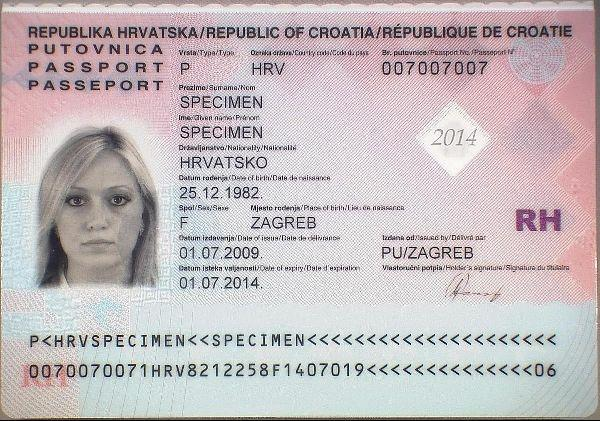
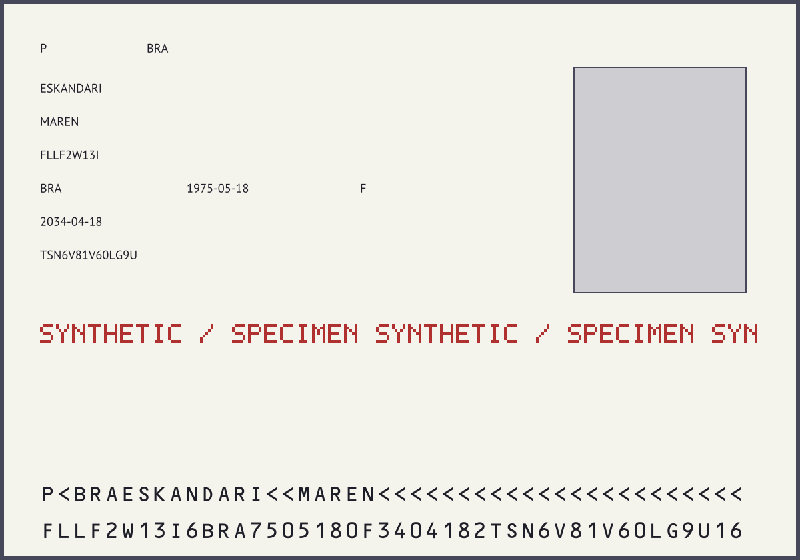
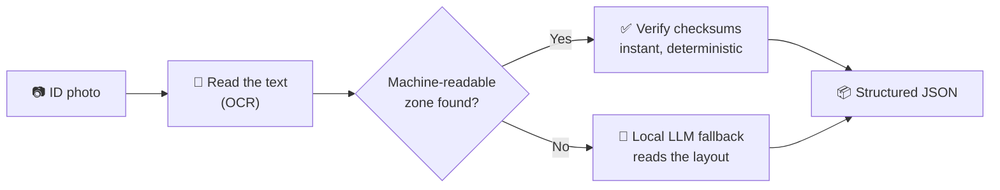
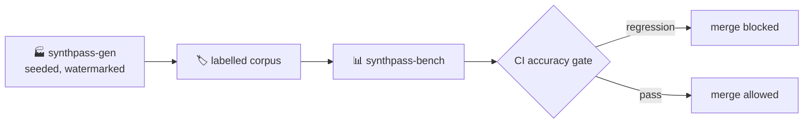
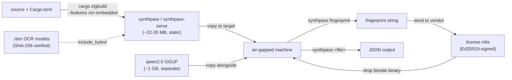

# 🪪 SynthPass

<!-- Language / backend -->


<!-- ML / inference -->


<!-- Standards / demo -->


[](https://ruledicaprio.github.io/SynthPass/)
[](docs/CORPUS_COVERAGE.md)
<!-- Posture -->


**Identity-document intelligence that runs entirely on your own machine.** SynthPass
*generates* perfectly-labelled synthetic identity documents, *benchmarks* extraction against
that ground truth, and *extracts* structured JSON from real documents — with **zero cloud
calls** at any stage.

The extraction path validates documents **deterministically via ICAO 9303 MRZ check digits**
(Tier 1) and only falls back to a local quantized LLM (Tier 2) when no valid MRZ exists. The
generation path produces unmistakably synthetic, watermarked documents whose labels are correct
*by construction* — the ground truth the benchmark grades against.

> **What this is for:** testing, validation, benchmarking, and AI/ML training data for
> identity-document systems — letting teams build and prove their pipelines without ever
> touching real customer PII. It is **not** a tool for producing documents that imitate genuine
> credentials: every generated artifact carries a mandatory synthetic watermark and a generic,
> non-country template, enforced in code. See [docs/BRANDING.md](docs/BRANDING.md) §4.

*Formerly `multi-level-id-strip` / `mlis`; see [CHANGELOG.md](CHANGELOG.md) for the crate-rename
mapping.*

## 📚 Contents

- [See it work](#️-see-it-work)
- [Quickstart](#-quickstart)
- [Make a pass, then read it back](#-make-a-pass-then-read-it-back)
- [How it works](#-how-it-works)
- [Why it's built this way](#-why-its-built-this-way)
- [Extraction: Tier 1 and Tier 2](#-extraction-tier-1-and-tier-2)
- [Accuracy, stated plainly](#-accuracy-stated-plainly)
- [Configuration](#️-configuration)
- [Licensing](#-licensing)
- [Air-gapped deployment](#-air-gapped-deployment)
- [Repository layout](#-repository-layout)
- [Security](#-security)
- [Documentation](#-documentation)
- [Acknowledgments](#-acknowledgments)
- [License](#-license)

## 🖼️ See it work



```
$ synthpass Croatian_passport_data_page.jpg
✔ SPECIMEN SPECIMEN · HRV passport 007007007 · verified in <1s, LLM never ran
```

A real run against the public-domain specimen above (from [`samples/`](samples/); see
[samples/README.md](samples/README.md) for how the collection is organized): every ICAO
9303 check digit on the printed MRZ verified mathematically, so the deterministic **Tier 1** path
handled it end to end — no model call, no guessing.

<details>
<summary>Full JSON output</summary>

```json
{
  "document_type": "P",
  "issuing_country": "HRV",
  "issuing_country_name": "Croatia",
  "document_number": "007007007",
  "surname": "SPECIMEN",
  "given_names": "SPECIMEN",
  "nationality": "HRV",
  "nationality_name": "Croatia",
  "date_of_birth": "1982-12-25",
  "sex": "F",
  "date_of_expiry": "2014-07-01",
  "mrz_line": "P<HRVSPECIMEN<<SPECIMEN<<<<<<<<<<<<<<<<<<<<<\n0070070071HRV8212258F1407019<<<<<<<<<<<<<<06",
  "mrz_checksums_valid": true,
  "validity": { "dates_well_formed": true, "in_date": false, "dob_before_expiry": true },
  "extraction_method": "mrz-deterministic"
}
```

`in_date: false` — the specimen expired in 2014 (live output also carries an exact
`days_until_expiry`). A valid composite check digit proves a faithful **read** of the printed
zone; whether the document is *in date* is a separate, non-cryptographic judgement.

</details>

**[Try it live →](https://ruledicaprio.github.io/SynthPass/)** The same Rust code compiled to
WebAssembly, running in your browser tab — no install, no server, no upload. Results are shown
for 10 seconds with a copy button, then wiped. **Nothing is persisted, because there is nowhere
to persist it to.**

## 🚀 Quickstart

Neither Docker nor Python is required to *run* SynthPass. Input is images only — JPEG, PNG, WebP,
TIFF, BMP, GIF. PDF and HEIC/HEIF are deliberately unsupported
([why](docs/ARCHITECTURE.md#8-known-limitations--what-tier-2-accuracy-actually-looks-like)).

> **Building on Windows:** Tier 2 (`llama-cpp-2`) compiles `llama.cpp`'s C++ and needs CMake,
> LLVM/libclang and MSVC Build Tools — a heavier ask than plain Rust. A `llama-cpp-sys-2` build
> error at step 2 is this, not a broken clone; use the Docker path below instead.

```powershell
git clone https://github.com/ruledicaprio/SynthPass.git
cd SynthPass

# 1. Download the Tier-2 model (~1 GB, not tracked in git).
curl -L -o qwen2.5-1.5b-instruct-q4_k_m.gguf `
  https://huggingface.co/Qwen/Qwen2.5-1.5B-Instruct-GGUF/resolve/main/qwen2.5-1.5b-instruct-q4_k_m.gguf
# The two OCR .rten weights (~12 MB) download and SHA-256-verify on first run.

# 2. Preflight: checks OCR, inferer, license and config before a real run.
cargo run -p synthpass-cli -- doctor

# 3. Extract a document (skip the license gate for local development).
$env:SYNTHPASS_LICENSE_SKIP = "1"
cargo run -p synthpass-cli -- samples/ocr_fixtures/Croatian_passport_data_page.jpg

# 4. ...or run the web app — upload page + JSON API on http://127.0.0.1:8080
cargo run -p synthpass-serve
```

```powershell
# API example, against synthpass-serve from step 4:
curl -F "file=@samples/ocr_fixtures/Passport_of_Serbia_ID_2009_version.jpg" http://127.0.0.1:8080/api/extract
```

<details>
<summary><b>No local toolchain?</b> Run the same steps in the Docker image CI uses</summary>

`docker/Dockerfile.builder` ships Rust + CMake + LLVM/clang, pre-built:

```powershell
# Windows (PowerShell)
docker build -f docker/Dockerfile.builder -t synthpass-builder:latest .
docker run --rm -e SYNTHPASS_LICENSE_SKIP=1 -v "${PWD}:/work" `
  -v synthpass_target:/work/target -v synthpass_cargo_registry:/usr/local/cargo/registry `
  -w /work synthpass-builder:latest cargo run -p synthpass-cli -- doctor
```

```bash
# Linux / macOS
docker build -f docker/Dockerfile.builder -t synthpass-builder:latest .
docker run --rm -e SYNTHPASS_LICENSE_SKIP=1 -v "$PWD:/work" \
  -v synthpass_target:/work/target -v synthpass_cargo_registry:/usr/local/cargo/registry \
  -w /work synthpass-builder:latest cargo run -p synthpass-cli -- doctor
```

Swap the trailing command for any step above. For `synthpass-serve`, drop
`-e SYNTHPASS_LICENSE_SKIP=1` and add `-p 8080:8080`. Git Bash on Windows needs
`MSYS_NO_PATHCONV=1` before `docker run`, or it mangles `-w /work` into a Windows path.

**Environment variables do not cross into the container on their own** — setting
`$env:SYNTHPASS_LICENSE_SKIP = "1"` only affects your host shell; `docker run` needs its own
`-e` flag, as shown. See [CONTRIBUTING.md](CONTRIBUTING.md#building--testing) for the full
build/test/cross-compile reference.

</details>

### CLI commands

| Command | What it does |
| --- | --- |
| `synthpass <file>` | Extract one document to `<file>.json` |
| `synthpass generate` | Produce synthetic labelled documents (no license needed) |
| `synthpass doctor` | Preflight OCR, inferer, license and configuration |
| `synthpass fingerprint` | Print this machine's license fingerprint |
| `synthpass verify-license` | Validate a `license.mlis` against the embedded key |
| `synthpass decrypt <file>` | Decrypt output written with `SYNTHPASS_KEY` |

## 🏭 Make a pass, then read it back

SynthPass doesn't just read documents — it **mints its own**, so accuracy is graded against ground
truth instead of vibes. `synthpass generate` renders synthetic TD3 passes in the same ICAO 9303
format as a real passport data page, but every one is **unmistakably synthetic**: a mandatory
"SYNTHETIC / SPECIMEN" watermark, a generic non-country template, and fictional seed-drawn
identities — *enforced in code, never a copy of a real document*. Each render ships a `.json`
sidecar with per-field ground-truth boxes and a checksum-valid MRZ built by `mrz::format_td3`, plus
an optional capture-degradation pass (`clean` | `mobile` | `scanner` | `worn` | `border-kiosk`)
that simulates real-world capture.



Then read it **back through the exact same extraction pipeline** — the check digits and labels grade
the OCR read, closing the loop:

```powershell
# 1. Mint one synthetic, watermarked, fully-labelled pass (same seed → byte-identical)
cargo run -p synthpass-cli -- generate --count 1 --seed 42 --profile clean --out-dir out/
#    → out/synthpass_42.png  (watermarked image)  +  out/synthpass_42.json  (per-field ground truth + MRZ)

# 2. Read it back with the real pipeline — every ICAO check digit re-verified
cargo run -p synthpass-cli -- out/synthpass_42.png
```

The `.json` sidecar is the ground truth the read is graded against — fictional by construction, and
correct because SynthPass built the MRZ itself:

```json
{ "surname": "ESKANDARI", "given_names": "MAREN", "document_number": "FLLF2W13I",
  "nationality": "BRA", "date_of_birth": "1975-05-18", "sex": "F", "date_of_expiry": "2034-04-18" }
```

Scale it up with `synthpass-bench` — it runs a whole generated corpus back through the *real*
extraction pipeline and reports how much survives, the hit rate CI gates every PR on:

```powershell
cargo run -p synthpass-bench -- --count 100 --seed 1 --profile clean
```

Text renders with vendored OFL fonts (OCR-B and PT Sans, embedded by default; `--no-default-features`
falls back to placeholder bars). Reports are generated, never hand-edited. Methodology in
[docs/SYNTHPASS.md](docs/SYNTHPASS.md); the degraded-profile red-team corpus in
[docs/ADVERSARIAL.md](docs/ADVERSARIAL.md).

## 🔀 How it works



Every document is checked against its own printed math first — that is what makes the green path
instant and *provably* correct rather than probably right. The model only runs on documents that
need it. Both stages run in the same process, on your machine, unchanged on Windows, macOS and
Linux.

The generation half closes the loop: synthetic documents carry labels that are correct by
construction, so accuracy claims come from a harness rather than from vibes.



## 🎯 Why it's built this way

Two principles drive every design decision, and they are non-negotiable:

- **Deterministic before probabilistic.** A checksum that can *prove* an answer always runs
  before a model that can only guess one. Given the same seed and parameters, generated output
  is byte-identical — reproducibility is treated as a correctness property, not a convenience.
- **Air-gapped or it does not ship.** There are zero network calls in the processing path. Model
  and font fetches are explicit, checksum-verified bootstrap steps, never runtime behaviour. No
  telemetry, no model CDN, no exceptions.

Supporting invariants: everything runs **in one process** (no Docker, no Python, no sidecars);
new dependencies must be pure Rust or justify themselves in writing; every PII-bearing value is
zeroized on drop and the audit trail is SHA-256-only.

Full reasoning in [docs/VISION.md](docs/VISION.md); engineering rationale and trade-offs in
[docs/ARCHITECTURE.md](docs/ARCHITECTURE.md).

## 🔐 Extraction: Tier 1 and Tier 2

**Tier 1 — deterministic.** The [`mrz`](crates/mrz/) crate is a zero-dependency ICAO 9303 parser
covering TD1/TD2/TD3 with every check digit verified (7-3-1 weighting), plus **checksum-verified
OCR repair**: common misreads (`B`↔`8`, `O`↔`0`, filler runs read as `K`/`L`, dropped or
hallucinated characters) are corrected by generating candidate readings and letting the composite
check digit prove which one matches the printed zone. When Tier 1 validates, the LLM never runs —
extraction is instant, deterministic and hallucination-free.

> **Validity ≠ authenticity.** A valid checksum proves the extraction faithfully matches what is
> printed — not that the document is genuine or unaltered. This is an OCR/data-integrity tool,
> never a forgery-detection tool, and that line does not move.

**Tier 2 — probabilistic, only when needed.** With no valid MRZ, a quantized Qwen 2.5 1.5B model
reads the OCR Markdown and fills the same [`Extraction`](crates/synthpass-core/src/lib.rs) schema.
[`synthpass-llm`](crates/synthpass-llm/) loads the GGUF once via
[`llama-cpp-2`](https://crates.io/crates/llama-cpp-2), verifies its SHA-256 against a known-good
hash before first use, and keeps it warm for the process lifetime — no sidecar, no gRPC port, no
Python anywhere in the codebase.

This is explicitly a fallback, not a second source of truth: a 1.5B model reading garbled OCR of a
layout it has never seen will not match a checksum for accuracy. The parity harness
(`crates/synthpass-llm/tests/parity.rs`) exists to catch regressions in that fallback, not to
promise perfection. That asymmetry is *why* Tier 1 exists and runs first on every document.

## 📊 Accuracy, stated plainly

Two different corpora measure two different things. Quoting only the flattering one would be
dishonest, so both are here.

| Corpus | What it measures | Result |
| --- | --- | --- |
| **Real specimens** ([`samples/`](samples/)) | Tier-1 hit rate on public-domain scans of genuine document designs | **17/18 (94%)** MRZ-bearing specimens, zero false positives on no-MRZ controls |
| **Generated** (`synthpass-bench`, 100 seeds, `clean`) | Tier-1 hit rate on synthetic documents end-to-end | **~55%** — CI gates at a 30% floor |

The generated-corpus number is much lower than the real-specimen number, and that gap is real:
misses cluster on the 14-character `personal_number` field, consistent with per-character OCR
noise compounding over a longer field rather than a single fixable defect. The CI floor sits
deliberately below the measured value to absorb cross-platform variance in OCR inference without
becoming flaky. Full account in [docs/ROADMAP.md](docs/ROADMAP.md)'s M4 notes.

When the general OCR pass cannot produce a checksum-valid MRZ, targeted retry passes
(MRZ-charset-constrained recognition over preprocessed crops) run automatically, and the check
digits decide which reading — if any — is trusted. Tier 2 runs only after Tier 1 still misses. One
documented permanent miss is a physically redacted specimen whose MRZ was never printed at all
(see [docs/CORPUS_COVERAGE.md](docs/CORPUS_COVERAGE.md)) — not a recoverable OCR gap.

## ⚙️ Configuration

**OCR**

| Variable | Default | Purpose |
| --- | --- | --- |
| `SYNTHPASS_OCR_MODEL_DIR` | `.` | Directory holding `text-detection.rten` / `text-recognition.rten` |
| `SYNTHPASS_OCR_AUTO_DOWNLOAD` | `1` | Fetch missing `.rten` files automatically; `0` requires pre-staged files |
| `SYNTHPASS_OCR_DETECTION_SHA256` / `..._RECOGNITION_SHA256` | *(built-in)* | Override expected checksums |
| `SYNTHPASS_OCR_MODEL_SKIP_VERIFY` | *(unset)* | Skip OCR model checksum verification |
| `SYNTHPASS_OCR_MAX_PASSES` / `SYNTHPASS_OCR_MAX_SECONDS` | `7` / `45` | Bound the MRZ retry loop |
| `SYNTHPASS_OCR_VERBOSE` | *(unset)* | `1` logs per-pass timing and region counts |
| `SYNTHPASS_OCR_ENGINE` | `rust` | Only `rust` since v1.2.0; any other value warns and falls back |

**Tier-2 model**

| Variable | Default | Purpose |
| --- | --- | --- |
| `SYNTHPASS_MODEL_PATH` | `./qwen2.5-1.5b-instruct-q4_k_m.gguf` | GGUF path — any GGUF works |
| `SYNTHPASS_MODEL_N_CTX` | `2048` | Context window in tokens |
| `SYNTHPASS_MODEL_SHA256` / `SYNTHPASS_MODEL_SKIP_VERIFY` | *(built-in)* / *(unset)* | Re-pin or skip the integrity check |
| `SYNTHPASS_LLM_CONTEXTS` | `1` | Concurrent Tier-2 contexts; raise only if the hardware has room |

**Server** (`synthpass-serve`)

| Variable | Default | Purpose |
| --- | --- | --- |
| `BIND_ADDR` | `127.0.0.1:8080` | Listen address |
| `SYNTHPASS_TOKEN` | *(unset)* | Require `Authorization: Bearer <token>`; **mandatory for non-loopback binds** |
| `SYNTHPASS_TLS_CERT` / `SYNTHPASS_TLS_KEY` | *(unset)* | Enable rustls TLS |
| `SYNTHPASS_MAX_QUEUE_DEPTH` | `4` | Reject uploads with `503` + `Retry-After` once this many Tier-2 requests are queued or in flight |
| `WORK_DIR` / `KEEP_WORK` | `work` / *(unset)* | Scratch directory; keep intermediates for debugging |

`GET /health` reports OCR engine, inference-backend status and license expiry. It sits outside the
auth layer deliberately — infrastructure probes rarely carry credentials, and a health check that
requires auth defeats half its purpose.

**Security and licensing**

| Variable | Default | Purpose |
| --- | --- | --- |
| `SYNTHPASS_AUDIT_LOG` | *(unset)* | Append PII-free SHA-256 audit records (JSONL) |
| `SYNTHPASS_KEY` | *(unset)* | Base64 32-byte AES-256 key → encrypt output to `<input>.json.enc` |
| `SYNTHPASS_LICENSE_PATH` | `license.mlis` | Path to the signed license file |
| `SYNTHPASS_LICENSE_SKIP` | *(unset)* | `1` bypasses license enforcement (development/CI) |
| `SYNTHPASS_LICENSE_PUBKEY` | *(embedded)* | Override the embedded verifying key, for testing |

> **Windows note:** the Tier-2 backend needs CMake + LLVM/libclang + MSVC to build
> `llama-cpp-2`'s bundled `llama.cpp`. The OCR engine needs no native toolchain at all.

## 🔑 Licensing

Extraction requires an offline, **Ed25519-signed** license — checked locally with no network call
of any kind. For local development, bypass it entirely with `SYNTHPASS_LICENSE_SKIP=1`. Generation
and benchmarking never require a license, because they involve no real PII.

Customer (`fingerprint` → `verify-license`) and vendor (`keygen` → `issue-license`) walkthroughs
are in **[docs/LICENSING.md](docs/LICENSING.md)**. The signed-bytes format, `verify_strict`
rationale, fingerprint scheme and — stated plainly — the threat model are in
[docs/ARCHITECTURE.md §6](docs/ARCHITECTURE.md#6-offline-cryptographic-licensing-v080).

> **This meters the official binary; it is not DRM.** The source is public, so anyone who rebuilds
> can strip the check. It exists to make the product sellable and auditable without phoning home,
> and it is not sold as tamper-proof.

## 📦 Air-gapped deployment

For a genuine "copy one file to an isolated machine" deployment, both binaries build as
statically-linked `x86_64-unknown-linux-musl` executables with the OCR models baked in — no
Docker, no shared libraries, no runtime network access.

```bash
cargo zigbuild --release --target x86_64-unknown-linux-musl \
  -p synthpass-cli -p synthpass-serve --features ocr-embedded

file target/x86_64-unknown-linux-musl/release/synthpass   # → "statically linked, stripped"
```



Copy the binaries and the GGUF onto the target, run `synthpass fingerprint`, obtain a license
bound to it, drop `license.mlis` beside the binary, and run. Toolchain rationale (why Zig over
`cross-rs` or manual `musl-gcc`) and known limitations are in
[docs/ARCHITECTURE.md §10](docs/ARCHITECTURE.md#10-v100-and-beyond).
`docker/Dockerfile.musl` packages the same binaries into a `FROM scratch` image.

## 📁 Repository layout

```
├── crates/
│   ├── mrz/                Zero-dependency ICAO 9303 engine: TD1/TD2/TD3, checksum-verified
│   │                       OCR repair, TD3 emission, date plausibility, ISO/ICAO country names
│   ├── mrz-wasm/           wasm-bindgen wrapper powering the browser demo
│   ├── synthpass-gen/      Synthetic document factory: seeded identities, TD3 MRZ, layout/
│   │                       render/labels, capture-degradation profiles, mandatory watermark
│   ├── synthpass-bench/    Benchmark harness + corpus runner behind the CI accuracy gate
│   ├── synthpass-core/     Canonical Extraction schema (v1 + v2) and audit/crypto helpers
│   ├── synthpass-ocr/      In-process pure-Rust OCR: ocrs/rten, preprocessing, model integrity
│   ├── synthpass-llm/      In-process Tier-2 inference: Qwen GGUF via llama-cpp-2, ChatML
│   │                       prompting, JSON repair, model integrity check
│   ├── synthpass-license/  Offline Ed25519 licensing: sign/verify, fingerprint, vendor issuer
│   │                       (`vendor` feature — never shipped to customers)
│   ├── synthpass-pipeline/ OcrEngine → Tier 1 MRZ → Tier 2 InferBackend → JSON.
│   │                       Image-only, license-agnostic.
│   ├── synthpass-cli/      CLI front-end (binary `synthpass`)
│   └── synthpass-serve/    axum web app: upload page, POST /api/extract with SSE progress,
│                           GET /health, bearer auth, TLS, license enforcement
├── docs/                   Vision, roadmap, branding, architecture, licensing, corpus coverage
├── docker/                 Builder, musl and serve images + compose file
├── fuzz/                   cargo-fuzz targets for the untrusted OCR ingest path
├── samples/                Public-domain specimen documents and expected outputs, organized into
│                           passports/, id_cards/, driving_licenses/, ocr_fixtures/, misc/ —
│                           see samples/README.md
├── scripts/                Development helpers
├── tools/                  Standalone scripts not themselves test fixtures (e.g. the Wikipedia
│                           specimen scraper)
└── web/                    GitHub Pages demo (static, client-side only)
```

## 🔒 Security

Everything binds to loopback by default, and `synthpass-serve` **refuses a non-loopback bind
unless `SYNTHPASS_TOKEN` is set**, then requires `Authorization: Bearer <token>` on every request.
`SYNTHPASS_TLS_CERT`/`SYNTHPASS_TLS_KEY` enable rustls TLS. Uploads and intermediate artifacts are
deleted after each request.

Two optional at-rest controls: `SYNTHPASS_AUDIT_LOG` appends a **PII-free** SHA-256 audit trail
(fingerprint, method, timestamp — never names or numbers), and `SYNTHPASS_KEY` encrypts output
JSON with AES-256-GCM. The Tier-2 model is SHA-256-verified before use, so a substituted GGUF
fails closed rather than running silently. The highest-value in-memory PII carriers — extracted
fields, the AES key, raw model output — are wiped on drop via `zeroize` (best-effort; see
[docs/ARCHITECTURE.md](docs/ARCHITECTURE.md) §7 for exactly what is and is not covered), and the
untrusted OCR ingest path is fuzz-tested with an always-on `proptest` suite plus opt-in
`cargo-fuzz` targets (`cargo fuzz run mrz_find_and_parse` / `mrz_parse_td` from `fuzz/`).

Vulnerability reporting and the full deployment checklist: [SECURITY.md](SECURITY.md).

## 📄 Documentation

Full index: [docs/README.md](docs/README.md).

| Doc | What it covers |
| --- | --- |
| [docs/VISION.md](docs/VISION.md) | Why the project exists, its principles, and permanent non-goals |
| [docs/ROADMAP.md](docs/ROADMAP.md) | M1–M6 milestones with a Definition of Done each; shipped vs. planned |
| [docs/BRANDING.md](docs/BRANDING.md) | Identra/SynthPass naming, messaging guardrails, commercial tiers |
| [docs/ARCHITECTURE.md](docs/ARCHITECTURE.md) | Engineering rationale, trade-offs, design history |
| [docs/SYNTHPASS.md](docs/SYNTHPASS.md) | Generation and benchmarking methodology |
| [docs/ADVERSARIAL.md](docs/ADVERSARIAL.md) | Degraded-capture red-team corpus |
| [docs/LICENSING.md](docs/LICENSING.md) | Customer and vendor CLI walkthroughs |
| [docs/CORPUS_COVERAGE.md](docs/CORPUS_COVERAGE.md) | Per-country corpus status and how to add a specimen |
| [CONTRIBUTING.md](CONTRIBUTING.md) | Build/test setup, fuzzing, git workflow, review checklist |
| [SECURITY.md](SECURITY.md) | Threat model, deployment checklist, vulnerability reporting |
| [CHANGELOG.md](CHANGELOG.md) | Full version-by-version history |

Questions or bugs: [open an issue](https://github.com/ruledicaprio/SynthPass/issues).

## 🙏 Acknowledgments

A solo-authored project where the ideas, architecture and direction are the human's; the execution
was AI-accelerated, across more than one model.

- **Rusmir Skopljak** ([@ruledicaprio](https://github.com/ruledicaprio)) — creator, architecture and direction
- **Claude Opus 4.8 / Sonnet 5** (Anthropic) — orchestration and implementation across the codebase
- **DeepSeek** — foundational architectural strategy
  ([docs/FOUNDATIONAL_STRATEGY.md](docs/FOUNDATIONAL_STRATEGY.md)), advisory and architectural review
- **GPT** (OpenAI) — the v2.0 roadmap and design records
  ([docs/synthpass_v2_0.md](docs/synthpass_v2_0.md), and the now-removed
  `docs/mlis_v2_0_0_preliminary_design.md` scratch notes), building on DeepSeek's foundational
  strategy

Copyright and authorship rest with the human author; the AI tools are credited as assistants, not
legal authors.

## 📜 License

[MIT](LICENSE) © Rusmir Skopljak. Bundled third-party licenses are in
[THIRD_PARTY_NOTICES.md](THIRD_PARTY_NOTICES.md). The MRZ demo's OCR-B model
(`web/tessdata/mrz.traineddata`) is © [DoubangoTelecom](https://github.com/DoubangoTelecom/tesseractMRZ),
BSD-3-Clause. Vendored generator fonts (OCR-B, PT Sans) are OFL 1.1 — see
`crates/synthpass-gen/fonts/README.md`.

---

*SynthPass is an open-source project under the Identra stewardship. See
[docs/BRANDING.md](docs/BRANDING.md) for trademark and attribution guidance.*
