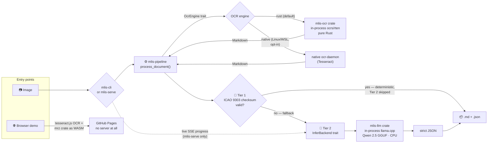
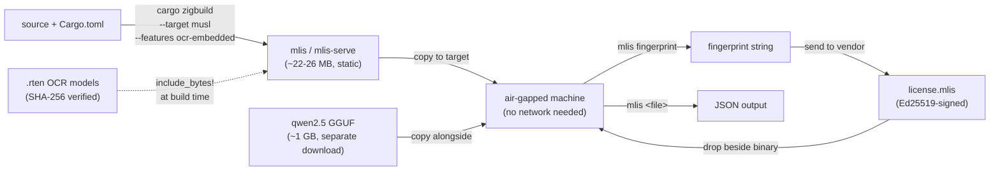

# 🪪 multi-level-id-strip (mlis)

<!-- Language / backend -->


<!-- ML / inference -->


<!-- OCR / runtime -->


<!-- MRZ / demo -->


[](https://ruledicaprio.github.io/multi-level-id-strip/)
<!-- Posture -->


Air-gapped document extraction: passports and ID cards in — structured JSON out, with **zero cloud calls**. A shared Rust pipeline OCRs the input, validates identity documents **deterministically via ICAO 9303 MRZ check digits** (Tier 1), and only falls back to a quantized Qwen 2.5 GGUF model (Tier 2) when no valid MRZ exists — which also catches other unstructured scans, though there's no dedicated extraction schema for them yet. Both stages run **in-process**: OCR via [`mlis-ocr`](crates/mlis-ocr/) (`ocrs`/`rten`, pure Rust) and Tier 2 via [`mlis-llm`](crates/mlis-llm/) (`llama-cpp-2`) — no Python, no gRPC sidecar, and no Docker container required, on Windows/macOS/Linux alike. Image-only (JPEG/PNG/WebP/TIFF/BMP/GIF); extraction requires an offline Ed25519-signed license (see [Licensing](#-licensing-v080) below) — the mechanism for selling and metering this without ever phoning home. As of **v1.0.0**, `mlis`/`mlis-serve` also build as a single, statically-linked `x86_64-unknown-linux-musl` binary with OCR models baked in — see [Static musl release](#-static-musl-release-v100) below. Use it from the CLI, a self-hostable axum web app, or the [**browser-only MRZ demo**](https://ruledicaprio.github.io/multi-level-id-strip/) — no PII ever leaves your machine. Full version-by-version history lives in [CHANGELOG.md](CHANGELOG.md); architecture rationale in [docs/ARCHITECTURE.md](docs/ARCHITECTURE.md).

## 🔀 Pipeline



Both stages are deliberately pluggable, even though each has one backend as of v0.7.5 — the trait boundary (see [`InferBackend`](crates/mlis-pipeline/src/infer.rs), [`OcrEngine`](crates/mlis-pipeline/src/ocr.rs)) is what let v0.6.0/v0.7.0 swap defaults from a Python/Docker sidecar to in-process inference with minimal blast radius, and it's the seam the pipeline's own tests mock against. The legacy gRPC Tier-2 backend and the Docker-based `docling-serve` OCR engine (the only one that parsed PDF) were deleted outright in v0.7.5, not just made non-default — mlis is now genuinely Docker/Python-free and image-only. **native** (Tesseract) remains a Linux/WSL-only OCR accuracy fallback. Full rationale in [docs/ARCHITECTURE.md](docs/ARCHITECTURE.md).

## 🖼️ Example

A public-domain Croatian passport specimen (from [`samples/`](samples/)) → deterministic **Tier 1** extraction, with every ICAO 9303 check digit verified. The LLM never runs:


```json
{
  "document_type": "P",
  "issuing_country": "HRV",
  "issuing_country_name": "Croatia",
  "document_number": "007007007",
  "surname": "SPECIMEN",
  "given_names": "SPECIMEN",
  "nationality": "HRV",
  "nationality_name": "Croatia",
  "date_of_birth": "1982-12-25",
  "sex": "F",
  "date_of_expiry": "2014-07-01",
  "mrz_line": "P<HRVSPECIMEN<<SPECIMEN<<<<<<<<<<<<<<<<<<<<<\n0070070071HRV8212258F1407019<<<<<<<<<<<<<<06",
  "mrz_checksums_valid": true,
  "validity": { "dates_well_formed": true, "in_date": false, "dob_before_expiry": true },
  "extraction_method": "mrz-deterministic"
}
```

> `in_date: false` — the specimen expired in 2014 (the live output also carries an exact `days_until_expiry`). A valid composite check digit proves a faithful **read** of the printed zone; whether the document is *in date* is a separate, non-cryptographic judgement.

## 🔐 Deterministic MRZ validation (Tier 1)

The [`mrz`](crates/mrz/) crate is a zero-dependency ICAO 9303 parser: TD1/TD2/TD3, every check digit verified (7-3-1 weighting), with **checksum-verified OCR repair** — common misreads (`B`↔`8`, `O`↔`0`, filler runs read as `K`/`L`, dropped or hallucinated characters) are corrected by generating candidate readings and letting the composite check digit prove which one matches the printed zone. A valid composite is mathematical proof of a faithful read; a failed one flags a bad scan or a tampered document. When Tier 1 validates, the LLM never runs: extraction is instant, deterministic and hallucination-free.

> **Date validity ≠ authenticity.** A valid MRZ checksum and self-consistent dates prove the extraction faithfully matches what's printed on the document — not that the document itself is genuine or unaltered. This is an OCR/data-integrity tool, not a forgery-detection tool.

**[Try the live demo →](https://ruledicaprio.github.io/multi-level-id-strip/)** The same Rust code compiled to WebAssembly, with tesseract.js OCR, on a static GitHub Pages site. **No data is persistent on any server — there is no server.** Images are downscaled and processed entirely inside your browser tab; the extracted JSON is shown for 10 seconds with a copy button, then wiped.

## 🧠 In-process LLM fallback (Tier 2, v0.6.0)

When no valid MRZ exists, Tier 2 asks a quantized Qwen 2.5 1.5B model to read the OCR Markdown and fill the same [`Extraction`](crates/mlis-core/src/lib.rs) schema Tier 1 produces. That model runs **in the same process** as the CLI or web server — [`mlis-llm`](crates/mlis-llm/) loads the GGUF once via [`llama-cpp-2`](https://crates.io/crates/llama-cpp-2), verifies its SHA-256 against a known-good hash before first use, and keeps it warm for the process lifetime. There's no sidecar to start, no gRPC port to open, and (as of v0.7.5) no Python anywhere in this codebase at all.

This is explicitly a probabilistic fallback, not a second source of truth: a 1.5B model reading garbled OCR of a document it's never seen the layout for will not match a deterministic checksum for accuracy, and the field-level parity harness (`crates/mlis-llm/tests/parity.rs`) exists to catch regressions in that fallback quality, not to promise perfection. That asymmetry is *why* Tier 1 exists and is tried first on every document.

## 🚀 Quickstart

No Docker or Python required — both OCR and Tier 2 run in-process. Image input only (JPEG, PNG,
WebP, TIFF, BMP, GIF) — PDF and HEIC/HEIF are not supported; see [docs/ARCHITECTURE.md](docs/ARCHITECTURE.md#8-known-limitations--what-tier-2-accuracy-actually-looks-like) for why. Extraction needs a license — see [Licensing](#-licensing-v080) below, or set `MLIS_LICENSE_SKIP=1` while developing.

**1. Download the model** (~1 GB, not tracked in git):
```powershell
curl -L -o qwen2.5-1.5b-instruct-q4_k_m.gguf `
  https://huggingface.co/Qwen/Qwen2.5-1.5B-Instruct-GGUF/resolve/main/qwen2.5-1.5b-instruct-q4_k_m.gguf
```
The two OCR `.rten` weight files (~12 MB total) are fetched and SHA-256-verified automatically on
first run into `MLIS_OCR_MODEL_DIR` (repo root by default) — no manual step needed.

**2. Run** (from the repo root):
```powershell
# Preflight: checks OCR/inferer/license and config before a real run
cargo run -p mlis-cli -- doctor

# CLI — one-shot extraction (binary `mlis`; needs a license, or MLIS_LICENSE_SKIP=1):
cargo run -p mlis-cli -- samples/Croatian_passport_data_page.jpg

# Web app — upload page + JSON API on http://127.0.0.1:8080
cargo run -p mlis-serve
```

```powershell
# API example:
curl -F "file=@samples/Passport_of_Serbia_ID_2009_version.jpg" http://127.0.0.1:8080/api/extract
```

## 🔑 Licensing (v0.8.0)

Extraction (`mlis <file>` and `mlis-serve`'s `/api/extract`) requires an offline, Ed25519-signed
license — set once and checked with no network call. `mlis doctor`, `mlis decrypt`, `mlis
fingerprint`, and `mlis verify-license` all keep working without one (you need `fingerprint` to
get one in the first place). For local development, skip enforcement entirely:
```powershell
$env:MLIS_LICENSE_SKIP = "1"
```

**Customer flow:**
```powershell
cargo run -p mlis-cli -- fingerprint                    # send this string to your vendor
# ...vendor emails back license.mlis...
cargo run -p mlis-cli -- verify-license license.mlis     # confirm it before relying on it
```

**Vendor flow** (the `mlis-license-issuer` binary — `vendor` feature, never shipped to customers):
```powershell
cargo run -p mlis-license --features vendor --bin mlis-license-issuer -- keygen
# keep the private key offline; embed the printed public key in crates/mlis-license/pubkey.b64

$env:MLIS_LICENSE_PRIVKEY = "<private key from keygen>"
cargo run -p mlis-license --features vendor --bin mlis-license-issuer -- `
  issue-license --customer "Acme Hospital" --tier enterprise --expires-in-days 365 `
  --hw <fingerprint from the customer> --out license.mlis
```

An empty `--hw` issues an unbound (site/trial) license instead of a machine-locked one. Full
design — signed-bytes format, `verify_strict`, fingerprint scheme, and the threat model stated
plainly — in [docs/ARCHITECTURE.md §6](docs/ARCHITECTURE.md#6-offline-cryptographic-licensing-v080).

### Configuration (environment)

| Variable | Default | Purpose |
| --- | --- | --- |
| `MLIS_OCR_ENGINE` | `rust` | `rust` (in-process ocrs/rten, default) or `native` (Linux/WSL Tesseract, `--features native-ocr`) |
| `MLIS_OCR_MODEL_DIR` | `.` (repo root) | directory holding `text-detection.rten` / `text-recognition.rten`, `rust` engine only |
| `MLIS_OCR_DETECTION_SHA256` / `MLIS_OCR_RECOGNITION_SHA256` | *(built-in hash)* | override the expected checksums, `rust` engine only |
| `MLIS_OCR_MODEL_SKIP_VERIFY` | *(unset)* | skip the `rust` engine's model checksum verification |
| `MLIS_OCR_AUTO_DOWNLOAD` | `1` | `rust` engine: fetch missing `.rten` files automatically; `0` requires pre-staged files |
| `MLIS_MODEL_PATH` | `./qwen2.5-1.5b-instruct-q4_k_m.gguf` | GGUF path |
| `MLIS_MODEL_N_CTX` | `2048` | context window (tokens) |
| `MLIS_MODEL_SHA256` / `MLIS_MODEL_SKIP_VERIFY` | *(built-in hash)* / *(unset)* | override the expected model checksum, or skip verification |
| `MLIS_MAX_QUEUE_DEPTH` | `4` | `mlis-serve`: reject uploads with 503 once this many Tier-2 requests are queued/in-flight |
| `MLIS_TOKEN` | *(unset)* | require `Authorization: Bearer <token>`; **mandatory for non-loopback `BIND_ADDR`** |
| `MLIS_TLS_CERT` / `MLIS_TLS_KEY` | *(unset)* | enable rustls TLS on `mlis-serve` |
| `MLIS_AUDIT_LOG` | *(unset)* | append PII-free SHA-256 audit records (JSONL) |
| `MLIS_KEY` | *(unset)* | base64 32-byte AES-256 key → encrypt output to `<input>.json.enc` (`mlis decrypt` to read) |
| `MLIS_LICENSE_PATH` | `license.mlis` | path to the signed license file |
| `MLIS_LICENSE_SKIP` | *(unset)* | `1` bypasses license enforcement entirely (local development/CI) |
| `MLIS_LICENSE_PUBKEY` | *(embedded)* | override the embedded verifying key (base64), for testing |

> **Windows note:** the native Tier-2 backend needs CMake + LLVM/libclang + MSVC to build `llama-cpp-2`'s bundled `llama.cpp` (see `crates/mlis-llm`). The default `rust` OCR engine (`mlis-ocr`, `ocrs`/`rten`) needs no native toolchain at all and works unchanged on Windows. The Tesseract-based `native` OCR engine (`ocr-daemon`) is Linux/WSL-only.
>
> **OCR accuracy note:** `ocrs` is brand-new to this project and has not yet been benchmarked against the field-accuracy parity harness that exists for Tier 2. On this workspace's own low/medium-resolution specimen samples, its out-of-the-box text recognition is not always clean enough to reconstruct a checksum-valid MRZ line (filler runs get mis-recognized or truncated) — see `docs/ARCHITECTURE.md`'s honest limitations section. When Tier 1 misses, Tier 2 still runs as usual.

## 📦 Static musl release (v1.0.0)

For a true "copy one file to an air-gapped machine" deployment, `mlis`/`mlis-serve` also build as
single, statically-linked `x86_64-unknown-linux-musl` binaries with the OCR models baked in — no
Docker, no runtime network access, no shared libraries to install on the target machine.

```bash
# Build (needs the musl target + Zig + cargo-zigbuild — see docker/Dockerfile.builder,
# or CONTRIBUTING.md's "Cross-compiling to musl locally" section):
cargo zigbuild --release --target x86_64-unknown-linux-musl -p mlis-cli -p mlis-serve \
  --features ocr-embedded

file target/x86_64-unknown-linux-musl/release/mlis   # → "statically linked, stripped"
```



Deploy: copy `mlis`, `mlis-serve`, and the separately-downloaded GGUF model onto the target
machine, run `mlis fingerprint` to get an identifier, obtain a license bound to it, drop
`license.mlis` beside the binary, then run `mlis <file>` — no further setup. See
[docs/ARCHITECTURE.md §10](docs/ARCHITECTURE.md#10-v100-and-beyond)
for the full toolchain rationale (why Zig over `cross-rs`/manual `musl-gcc`) and known
limitations. `docker/Dockerfile.musl` packages the same binaries into a minimal `FROM scratch`
image, if you'd rather run it in a container than as a raw binary.

## 📁 Repository Layout

```
├── crates/
│   ├── mrz/           Zero-dep ICAO 9303 engine: TD1/TD2/TD3, checksum-verified OCR
│   │                  repair, date-plausibility, ISO/ICAO country names
│   ├── mrz-wasm/      wasm-bindgen wrapper for the browser demo
│   ├── mlis-core/     Canonical Extraction schema + Tier-3 audit/crypto helpers
│   ├── mlis-llm/      In-process Tier-2 inference: Qwen GGUF via `llama-cpp-2`, ChatML
│   │                  prompting, JSON repair, model integrity check
│   ├── mlis-ocr/      In-process pure-Rust OCR: ocrs/rten, model download + integrity check
│   ├── mlis-license/  Offline licensing: Ed25519 sign/verify, fingerprint, vendor issuer binary
│   │                  (`vendor` feature; keygen + issue-license, never shipped to customers)
│   ├── mlis-pipeline/ OcrEngine trait (rust | native) → Tier 1 MRZ → Tier 2
│   │                  InferBackend (native) → JSON. Image-only, license-agnostic.
│   ├── mlis-cli/      CLI front-end (binary `mlis`; also `decrypt`/`fingerprint`/`verify-license`)
│   ├── mlis-serve/    axum web app: upload page + POST /api/extract (SSE progress on Tier 2),
│   │                  bearer auth + TLS + license enforcement
│   └── ocr-daemon/    Native Tesseract+Leptonica OCR engine (Linux/WSL only, accuracy fallback)
├── docker/           Optional container packaging: Dockerfile.serve + docker-compose.yml
│                     for `mlis-serve` — not required for any functional code path
├── web/              GitHub Pages demo site (static, client-side only)
├── samples/          Public-domain specimen documents + example outputs
└── docs/             Architectural manifest & roadmap
```

## 🔒 Security (Tier 3)

Everything runs on loopback by default. `mlis-serve` **refuses a non-loopback bind unless `MLIS_TOKEN` is set**, then enforces `Authorization: Bearer <token>` on every request; set `MLIS_TLS_CERT`/`MLIS_TLS_KEY` for rustls TLS. Uploaded files and intermediate artifacts are deleted after each request. Two optional at-rest controls: `MLIS_AUDIT_LOG` appends a **PII-free** SHA-256 audit trail (fingerprint + method + timestamp, no names/numbers), and `MLIS_KEY` (base64 32-byte AES-256) encrypts the output JSON to `<input>.json.enc` — decrypt with `mlis decrypt`. The native Tier-2 model itself is SHA-256-verified before use, so a tampered or substituted GGUF fails closed rather than running silently. As of **v0.9.0**, the highest-value in-memory PII carriers (the extracted fields, the AES key, the raw Tier-2 output) are wiped on drop (`zeroize`, best-effort — see [docs/ARCHITECTURE.md](docs/ARCHITECTURE.md) §7 for exactly what is and isn't covered), and the untrusted OCR ingest path is fuzz-tested — an always-on `proptest` suite plus opt-in `cargo-fuzz` coverage (`cargo fuzz run mrz_find_and_parse` / `mrz_parse_td` from `fuzz/`). Full rationale in [docs/ARCHITECTURE.md](docs/ARCHITECTURE.md).

## 🙏 Acknowledgments

A solo-authored project where the ideas, architecture and direction are the human's; the execution was AI-accelerated.

- **Rusmir Skopljak** ([@ruledicaprio](https://github.com/ruledicaprio)) — creator, author, architecture & direction
- **Claude Opus 4.8 / Sonnet 5** (Anthropic) — orchestration & implementation
- **DeepSeek v4 Pro** — advisory / architectural review

Copyright and authorship rest with the human author; the AI tools are credited as assistants, not legal authors.

## 📜 License

[MIT](LICENSE) © Rusmir Skopljak. Bundled third-party licenses are in [THIRD_PARTY_NOTICES.md](THIRD_PARTY_NOTICES.md); the security policy is in [SECURITY.md](SECURITY.md). The MRZ demo's OCR-B model (`web/tessdata/mrz.traineddata`) is © [DoubangoTelecom](https://github.com/DoubangoTelecom/tesseractMRZ), BSD-3-Clause.
