# 🏛️ Architectural Manifest: multi-level-id-strip (mlis) — Air-Gapped Document Processing (v1.0.0)

## 1. Executive Summary
This repository houses the design and implementation of a localized, air-gapped machine learning architecture dedicated to processing identity documents (passports, ID cards). Engineered for high-stakes rental and compliance applications, the system automates data extraction while enforcing strict data privacy, zero recurring cloud API costs, and optimal local hardware utilization. By decoupling high-concurrency file orchestration from heavy machine learning workloads, the pipeline achieves a robust, production-ready foundation for sensitive Personally Identifiable Information (PII) processing.

As of **v1.0.0**, the whole pipeline is a single, statically-linked `x86_64-unknown-linux-musl` binary: OCR and LLM inference both run in-process (no Python, no gRPC sidecar, no Docker), OCR models are embedded at compile time, and extraction is gated behind an offline Ed25519-signed license — no cloud call anywhere in the processing path, ever. This document describes what's true *today*, in this repo, right now; for the version-by-version path that got here (v0.6.0 → v1.0.0) see [CHANGELOG.md](../CHANGELOG.md). See [§7](#7-security--compliance-posture) for the security/PII posture and [§8](#8-known-limitations--what-tier-2-accuracy-actually-looks-like) for accuracy caveats stated plainly rather than oversold.

## 2. Architectural Foundation: Two-Tier Extraction Behind a Pluggable Inference Seam
The system is a **Rust-first pipeline with a deliberately narrow, swappable boundary** where probabilistic inference happens — everything else is deterministic Rust:

* **Deterministic MRZ Core (`mrz` crate, zero deps):** ICAO 9303 TD1/TD2/TD3 parsing with full 7-3-1 check-digit validation and checksum-verified OCR repair. Zero runtime dependencies, so the identical code compiles natively for the pipeline and to WebAssembly for the public browser demo.
* **Pipeline Core (`mlis-pipeline` crate):** Owns the end-to-end sequence — OCR → Markdown persistence → Tier 1 MRZ validation → Tier 2 `InferBackend` fallback → JSON — behind a single `process_document()` entry point. Both binaries are thin wrappers around it. Concurrency control (a single-flight semaphore + an observable queue-depth counter) lives *here*, not in the backend, so the "one concurrent Tier-2 call" invariant holds. Deliberately license-agnostic — see [§6](#6-offline-cryptographic-licensing-v080) for where enforcement actually lives.
* **OCR Engine (pluggable behind a trait — introduced in v0.7.0):** An `OcrEngine` trait ([`crates/mlis-pipeline/src/ocr.rs`](../crates/mlis-pipeline/src/ocr.rs)) abstracts text extraction. Two implementations exist today, selected at runtime via `MLIS_OCR_ENGINE`:
  * **`RustOcrEngine`** (feature `ocr-native-rust`, **default**) — the [`mlis-ocr`](../crates/mlis-ocr/) crate loads two `.rten` weight files (text detection + recognition) via [`ocrs`](https://crates.io/crates/ocrs)/[`rten`](https://crates.io/crates/rten), fetching and SHA-256-verifying them automatically on first use, and keeps the engine warm in-process. Zero C/C++ dependencies, works unchanged on Windows.
  * **`NativeEngine`** (feature `native-ocr`, Linux/WSL only) — the in-tree `ocr-daemon` engine (Tesseract + Leptonica, DPI normalization, orientation correction, deskew, Otsu binarization). Kept as an accuracy fallback with real confidence-scored orientation correction the brand-new `ocrs` engine doesn't yet have proven parity with.

  Both engines are image-only. **Supported input formats:** JPEG, PNG, WebP, TIFF, BMP, GIF (whatever the `image` crate's default features decode) — covers Android's default camera formats and general use. **Not supported:** PDF (no OCR engine parses it as of v0.7.5 — see below) and HEIC/HEIF, Apple's default photo format since iOS 11 (no permissively-licensed pure-Rust decoder exists; the two that do are AGPL-3.0, which would force this MIT-licensed, commercially-offline-licensed binary to AGPL too — see [§8](#8-known-limitations--what-tier-2-accuracy-actually-looks-like)). Both are rejected with a clear, actionable error rather than a silent or generic failure. In practice this is less limiting than it sounds: many iOS share/export flows already convert HEIC to JPEG automatically.
* **Inference Engine (pluggable behind a trait — introduced in v0.6.0):** An `InferBackend` trait ([`crates/mlis-pipeline/src/infer.rs`](../crates/mlis-pipeline/src/infer.rs)) abstracts *how* Tier 2 turns OCR Markdown into a structured `Extraction`. One implementation exists today:
  * **`NativeInferer`** (feature `inferer-native`, default and, as of v0.7.5, the only backend) — the [`mlis-llm`](../crates/mlis-llm/) crate loads the quantized Qwen 2.5 GGUF once via [`llama-cpp-2`](https://crates.io/crates/llama-cpp-2) (Rust bindings to `llama.cpp`), verifies its SHA-256 before first use, and keeps it warm in-process for the life of the CLI or web-server process. No sidecar, no network hop, no second language runtime.

  The trait boundary itself is still earned even with one backend: it's the seam the pipeline's own tests mock against (a plain in-process `InferBackend` impl, no network server needed), and it's what let v0.6.0 swap the default from a Python sidecar to in-process inference with zero changes to `mlis-cli`/`mlis-serve` beyond a health-check label.
* **Licensing (`mlis-license` crate, introduced in v0.8.0):** Ed25519 sign/verify, machine fingerprinting, and a separate vendor-only issuer binary — see [§6](#6-offline-cryptographic-licensing-v080) for the full design.
* **Orchestration Layer (`mlis-cli`, binary `mlis`):** A lightweight asynchronous Rust client handling local file system I/O, CLI argument validation, `mlis doctor` (preflight: OCR + inferer + license, config sanity), `mlis decrypt`, `mlis fingerprint`, and `mlis verify-license`.
* **Web Front-End (`mlis-serve`, axum):** Exposes the same pipeline as an upload page and a JSON API, with bearer-token auth, license enforcement, and optional rustls TLS, and forwards Tier-2 token deltas to the browser over SSE so uploads show live progress instead of a frozen status line.

## 3. Why the Inference Engine Became Pluggable
Through v0.5.x, Tier 2 was hardwired to a gRPC sidecar: correct, but it meant every deployment needed a Python virtualenv (or a second Docker container) purely to keep an LLM warm that Rust is fully capable of running itself. That's a real cost for the target deployment shape — an offline, sellable, single-binary appliance — so v0.6.0 introduced the `InferBackend` trait to let the *default* move to in-process inference without deleting the working gRPC path outright, kept for one release as a fallback. That release passed: v0.7.5 deleted the gRPC backend, `proto/inferer.proto`, and the entire `python/` sidecar. The trait boundary is intentionally the only place backend choice matters:

```rust
#[async_trait]
pub trait InferBackend: Send + Sync {
    async fn extract(&self, markdown: &str) -> Result<Extraction, String>;
    async fn extract_stream(&self, markdown: &str, tx: &mpsc::Sender<ProcessEvent>) -> Result<Extraction, String>;
    fn describe(&self) -> String;
    async fn health(&self) -> Result<String, String>;
}
```
`NativeInferer::extract` and `extract_stream` run the actual `llama.cpp` generation loop inside `tokio::task::spawn_blocking` (it's CPU-bound, synchronous work — running it on the async executor would stall every other in-flight request), and forward streaming deltas back to the caller with non-blocking `try_send`, so a stalled browser connection can never extend how long the single Tier-2 concurrency permit is held. `LlamaBackend::init()` is a process-wide singleton in `llama.cpp` itself, so the model is loaded lazily on first use (`tokio::sync::OnceCell`) and never re-initialized.

## 4. Hardware Allocation & Performance Strategy
Both the OCR and inference backends are **CPU-only** — that's a deliberate choice, not a current limitation to apologize for: it's what makes a self-contained musl binary possible at v1.0.0, and it's what lets the appliance target run on hardware with no discrete GPU at all. Since v0.7.5 there is no GPU-accelerated path left in this codebase at all (the legacy gRPC backend was the only one that supported CUDA, via `llama-cpp-python`) and no VRAM-contention design question to answer — inference just costs wall-clock time (~1-2 minutes for a single-document extraction on modest hardware, per the field-accuracy harness runs in CI).

## 5. Pipeline Execution Flow

Split into two diagrams for readability — the license gate (short, identical shape for both binaries) and the document-processing sequence it guards (the meaty part: OCR → Tier 1 → Tier 2 → persist).

### 5.1 License gate

```mermaid
sequenceDiagram
    autonumber
    actor U as User
    participant B as mlis-cli / mlis-serve
    participant L as 🔑 mlis-license (gate)
    participant P as mlis-pipeline

    U->>B: image file path / multipart upload
    B->>L: check license (CLI: once per run; serve: once at boot + cheap per-request expiry check)
    alt license invalid/expired and not skipped
        L-->>B: refuse
        B-->>U: ❌ license error
    else valid (or MLIS_LICENSE_SKIP=1)
        B->>P: process_document(path) — see §5.2
    end
```

### 5.2 Document processing (`Pipeline::process_document`)

```mermaid
sequenceDiagram
    autonumber
    actor U as User
    participant B as mlis-cli / mlis-serve
    participant P as mlis-pipeline (Pipeline)
    participant D as OCR engine (rust / native)
    participant I as 🧠 NativeInferer

    P->>D: OcrEngine::to_markdown(file)
    D-->>P: structured Markdown
    P->>P: write <input>.md
    P->>P: Tier 1 — ICAO 9303 MRZ checksum validation (TD1/TD2/TD3)
    alt MRZ composite check digit valid
        P->>P: deterministic JSON (+ country names, date validity), Tier 2 skipped
    else no MRZ / checksums failed
        P->>P: acquire llm_semaphore permit (+ increment queue-depth)
        P->>I: extract(markdown) / extract_stream(markdown, tx)
        I->>I: mlis-llm: warm GGUF (llama.cpp, in-process), ChatML prompt, greedy sample
        I-->>P: Extraction (or streamed deltas, then final result)
        P->>P: release permit (- decrement queue-depth)
    end
    P->>P: persist JSON (AES-256-GCM if MLIS_KEY) + PII-free audit record
    P-->>B: PipelineResult { markdown, extracted, mrz, method }
    B-->>U: console output / JSON response (SSE deltas if streaming)
```



### CLI (`mlis-cli`, binary `mlis`)
1. **Ingestion:** the user passes a local image path to the Rust binary (`cargo run -p mlis-cli -- <file>`).
2. **Validation:** Rust verifies file existence, then checks the license (see [§6](#6-offline-cryptographic-licensing-v080); skipped for `decrypt`/`doctor`/`fingerprint`/`verify-license`), then hands off to `Pipeline::process_document`, which auto-generates the target `.md` output path.
3. **OCR:** the active `OcrEngine` — the in-process `rust` engine by default — returns structured Markdown, or a named, actionable error for PDF/HEIC input (see [§2](#2-architectural-foundation-two-tier-extraction-behind-a-pluggable-inference-seam)).
4. **Persistence:** the Markdown is written to disk.
5. **Tier 2 (if triggered):** `NativeInferer` runs, serialized behind `Pipeline`'s semaphore.
6. **JSON generation:** the backend returns a typed `Extraction`; the pipeline writes a `.json` (or encrypted `.json.enc`) adjacent to the source and appends an audit record.
7. **`mlis doctor`:** preflight — for the `rust` OCR engine, checks the two `.rten` model files exist and SHA-256-verifies them; for `native`, no network check needed. Calls `Pipeline::infer_health()`, which confirms the GGUF file exists and SHA-256-verifies it (or reports the skip). Also verifies the configured license (or reports the skip).

### Web App (`mlis-serve`)
1. **GET /** serves an embedded, dependency-free upload page.
2. **POST /api/extract** accepts a multipart file upload (≤ 20 MB), stores it under an ephemeral `work/` directory, and invokes the same pipeline core — as an SSE stream, so Tier-2 token deltas reach the browser in real time instead of behind a frozen status line.
3. The terminal event bundles both artifacts: `{ "filename", "markdown", "extracted", "method", "mrz", "error" }`. A Tier-2 failure degrades gracefully — the OCR Markdown is still returned alongside the error.
4. **Overload protection:** `MLIS_MAX_QUEUE_DEPTH` (default 4) rejects new uploads with `503` once that many Tier-2 requests are queued/in-flight, instead of accepting them unboundedly and blocking behind the single-flight semaphore.
5. **Auth:** when `MLIS_TOKEN` is set, every request needs `Authorization: Bearer <token>`; a non-loopback `BIND_ADDR` without a token is refused at startup. Optional rustls TLS via `MLIS_TLS_CERT`/`MLIS_TLS_KEY`.
6. **Licensing:** refuses to boot without a valid license unless `MLIS_LICENSE_SKIP=1` (see [§6](#6-offline-cryptographic-licensing-v080)); a cheap expiry-only check runs on every `/api/extract` request so a long-running server stops serving once its license expires.
7. **PII hygiene:** working files are deleted after each request (`KEEP_WORK=1` retains them for debugging).
8. Configuration via environment: `BIND_ADDR`, `MLIS_OCR_ENGINE`, `MLIS_MODEL_PATH`, `MLIS_MAX_QUEUE_DEPTH`, `MLIS_TOKEN`, `MLIS_AUDIT_LOG`, `MLIS_KEY`, `MLIS_LICENSE_PATH`, `MLIS_LICENSE_SKIP`, `WORK_DIR`.

## 6. Offline Cryptographic Licensing (v0.8.0)
As of v0.8.0, the shipped `mlis`/`mlis-serve` binaries require a signed license to run their extraction path — Ed25519-signed license files so the binary can be sold and metered for air-gapped enterprise distribution without ever phoning home. See [`crates/mlis-license/`](../crates/mlis-license/).

* **Format:** a license file (`license.mlis`, default path — override with `MLIS_LICENSE_PATH`) is a small JSON envelope: `payload` (base64 of the *exact* signed `LicensePayload` JSON bytes) + `signature` (base64 Ed25519 signature over those same bytes). The verifier checks the signature over the literal stored bytes and only deserializes afterward — unlike a design that re-serializes the payload before verifying (which can desync signer and verifier on field-order/whitespace drift), a valid license can never fail to verify this way. Verification uses `verify_strict` (not the plain `Verifier::verify`), rejecting non-canonical/cofactored signature malleability — the conservative default per RFC 8032.
* **Embedded public key:** `crates/mlis-license/pubkey.b64`, loaded via `include_str!` and parsed once. A public key isn't a secret, so a checked-in file is safe; rotation is a one-file swap. `MLIS_LICENSE_PUBKEY` overrides it at runtime for testing, mirroring the `MLIS_MODEL_SHA256`/`MLIS_OCR_*_SHA256` known-good-plus-override convention used elsewhere in this workspace. **The pinned key ships as a placeholder** generated during development — a real vendor deployment must run `mlis-license-issuer keygen` and replace `pubkey.b64` before issuing real licenses.
* **Machine fingerprint (optional binding):** `machine_fingerprint()` hashes `/etc/machine-id` (falling back to `/var/lib/dbus/machine-id`) via the same `mlis_core::audit::sha256_hex` the audit log uses — deliberately *not* an OS-name+hostname+CPU-brand approach, since hostname is trivially changed and CPU brand is identical across thousands of same-SKU machines. An empty `hw_fingerprint` in the payload skips the check entirely (site/trial licenses).
* **Enforcement lives in the binaries, not `mlis-pipeline`** — the pipeline stays a clean, license-agnostic, reusable library:
  * **`mlis` CLI:** checked once at startup, only on the extraction path (`mlis <file>`). `decrypt`/`doctor`/`fingerprint`/`verify-license` all stay usable without a valid license — you need `fingerprint` to obtain one in the first place.
  * **`mlis-serve`:** signature + fingerprint verified once at boot (`license_refusal()`, refuses to start on invalid/expired/mismatched, mirroring the existing `startup_refusal()` non-loopback gate); a cheap expiry-only comparison (no signature re-verification) then runs on every `/api/extract` request, so a long-running server stops serving once its license expires without paying a full re-verify cost per request.
  * **`MLIS_LICENSE_SKIP=1`** bypasses enforcement for local development/CI, mirroring `MLIS_MODEL_SKIP_VERIFY`.
* **Issuance is a separate, `vendor`-feature-gated binary** (`mlis-license-issuer`: `keygen` + `issue-license` subcommands) — never compiled into the customer-facing binaries. This is a deliberate hardening over gating issuance by an env-var check inside the *same* binary: the shipped `mlis`/`mlis-serve` contain no signing code, no private-key handling, and no keygen RNG dependency at all — `cargo check -p mlis-license` (default features) builds clean without pulling in any of the `vendor`-only dependency subtree.
* **CLI surface stays hand-rolled, not clap.** The shipped binary goes from 3 to 5 commands (`extract`/`decrypt`/`doctor` + new `fingerprint`/`verify-license`), both flag-light enough for the existing positional dispatch. The genuinely flag-heavy command (`issue-license`: `--customer`, `--tier`, `--expires-in-days`, `--hw`, `--features`, `--out`) lives entirely in the off-binary vendor issuer, where dependency weight doesn't matter.
* **Threat model, stated plainly** (matches this project's house style of documenting limitations rather than overselling — see [§8](#8-known-limitations--what-tier-2-accuracy-actually-looks-like)): the fingerprint binds to an OS *installation*, not physically to hardware — root can read/copy `machine-id`, it survives a disk clone, and expiry relies on the system clock, which an air-gapped operator can roll back. Most fundamentally, because the source is public, anyone who rebuilds from source can strip the check. **This meters and gates the official pre-built binary, deters casual license-sharing, and produces a compliance artifact — it is not DRM and is not sold as tamper-proof.** True hardware attestation would need a TPM/HSM, out of scope here.

## 7. Security & Compliance Posture
Designed for environments with stringent regulatory requirements (e.g., GDPR), the pipeline enforces a **Zero-Telemetry, Air-Gapped Posture**:
* **No External Network Calls:** all processing, from OCR to LLM inference, occurs entirely inside the same process with no network call at all. No PII ever leaves the host machine.
* **Loopback by Default:** the web app binds to `127.0.0.1` unless explicitly overridden. It ships **without authentication** — if you expose it beyond loopback (`BIND_ADDR=0.0.0.0:8080`), `mlis-serve` refuses to start unless `MLIS_TOKEN` is set. It processes identity documents; treat it accordingly.
* **Model integrity:** the native inference backend SHA-256-verifies the GGUF (`MLIS_MODEL_SHA256` to pin a different build, `MLIS_MODEL_SKIP_VERIFY=1` to bypass for local development), and the native `rust` OCR engine SHA-256-verifies both `.rten` weight files (`MLIS_OCR_DETECTION_SHA256`/`MLIS_OCR_RECOGNITION_SHA256`, `MLIS_OCR_MODEL_SKIP_VERIFY=1`), before first use — a tampered or substituted model/weight file fails closed instead of silently running.
* **License integrity:** Ed25519 `verify_strict` fails closed on any tampered, corrupted, or wrong-key-signed license — see [§6](#6-offline-cryptographic-licensing-v080).
* **PII memory hardening (v0.9.0):** the highest-value in-memory PII carriers are wrapped so they're wiped (`zeroize::Zeroize`) when dropped, shrinking the window a swap file or crash dump could leak identity data: `mlis_core::Extraction` (`ZeroizeOnDrop`), the AES-256 encryption key (`Zeroizing<[u8; 32]>` from `key_from_base64` through `Pipeline`), the pretty-printed JSON string persisted/encrypted in `write_outputs`, and the raw Tier-2 LLM output + ChatML prompt in `mlis-llm::generate`. `mrz::MrzData` gets the same treatment behind an *optional* `zeroize` feature (mirroring its existing optional `serde` feature) so `mrz-wasm`'s `wasm32-unknown-unknown` build — which never enables it — stays genuinely zero-dependency. This is **best-effort, not a hard guarantee**: it does not (and cannot, without threading a custom secret type through `serde`) wipe the internal copies `serde_json::Value`/`to_string`/`to_value` allocate while building JSON; it does not cover the `<input>.md`/`<input>.json` plaintext artifacts written to disk (only the optional `MLIS_KEY`-encrypted `.json.enc` is protected at rest); `PipelineResult.markdown` — returned to callers (`mlis-cli`, `mlis-serve`) for display/persistence — is deliberately left a plain `String` rather than forcing a caller-side API break or an extra unwiped duplicate allocation; and none of this defends against a live-process attacker or the OS paging memory to swap before a value drops.
* **Fuzz-tested ingest path (v0.9.0):** `mrz::find_and_parse` and `parse_td1/td2/td3` — the only ingest-path component that both handles untrusted OCR text with raw byte-index repair logic *and* compiles to WASM for the public browser demo — are covered by an always-on `proptest` "never panics" suite (dev-dependency, runs in `cargo test --workspace` on every PR) plus deep coverage-guided fuzzing via `cargo-fuzz` (`fuzz/`, opt-in `workflow_dispatch` CI job, not a required check — nightly-only and non-deterministic timing, the same reasoning that keeps `native-llm` off the required list). Image decoding (`image` crate, fuzzed extensively upstream) and `mlis-llm::repair::parse_extraction` (would drag the `llama-cpp-2`/cmake build into the fuzz job) are explicitly out of scope for this milestone — documented follow-ups, not oversights.
* **No Docker/Python dependency surface:** as of v0.7.5 there is no Python virtualenv, gRPC sidecar, or Docker container in the default code path at all — the legacy gRPC Tier-2 backend and the `docling-serve` OCR engine were deleted outright, not merely made non-default. `docker/docker-compose.yml` remains only as a convenience for building/running the containerized `mlis-serve` image.
* **Deterministic-first design:** Tier 1 is tried before Tier 2 on every document specifically because MRZ checksum validation is provably correct where LLM extraction is only probably correct — see [§8](#8-known-limitations--what-tier-2-accuracy-actually-looks-like).

## 8. Known Limitations & What Tier-2 Accuracy Actually Looks Like

**Image-only as of v0.7.5.** PDF input is no longer accepted — the only engine that ever parsed it, `docling-serve`, was deleted along with the rest of its Docker dependency. HEIC/HEIF (Apple's default photo format) is also rejected: no permissively-licensed pure-Rust decoder exists yet (the pure-Rust options that do exist are AGPL-3.0, which would force this project's MIT license — and the offline-licensing business model shipped in v0.8.0 — to AGPL too). Both cases fail with a clear, named error rather than a generic OCR failure. This is a deliberate scope cut, not an oversight; revisiting HEIC support (a commercial license, or an in-house permissive decoder) is an open follow-up, not a rejected idea.

**Licensing meters the binary, not the hardware or the source (v0.8.0).** See [§6](#6-offline-cryptographic-licensing-v080)'s threat-model paragraph in full — summarized, the fingerprint binds to an OS installation (spoofable by root, survives disk cloning), expiry trusts the system clock, and a from-source rebuild bypasses the check entirely, since the source is public. This is intentional scope, not a bug: it deters casual sharing and gives a compliance artifact for the pre-built binary, and isn't marketed as DRM.

The 1.5B model is small enough to run comfortably on CPU, and that comes with a real accuracy ceiling worth stating plainly rather than glossing over. The field-level parity harness (`crates/mlis-llm/tests/parity.rs`, run against real specimen documents in `samples/`) measured a **~45% per-field exact-match rate** against deterministic-MRZ ground truth (date-format normalized) on the current model. It's strong on well-formed front-page passport/ID layouts and materially worse on rear-side ID cards and heavily garbled MRZ blocks — exactly the failure mode Tier 1 exists to route around. The harness asserts a 25%-floor regression guard (catching a broken prompt or a JSON-repair bug), not an accuracy target, and is deliberately not gated at a higher bar: raising the bar is a model/prompt-quality project, not a correctness one, and belongs in a future milestone rather than blocking this one.

**OCR accuracy (v0.7.0, new and unverified against this project's corpus).** `ocrs` is brand-new to this codebase and, unlike Tier 2, has no field-accuracy parity harness yet — there's no ground-truth-labeled OCR text corpus to compare against, only the downstream signal of whether Tier 1's MRZ checksum happens to validate. Manual testing against this workspace's own specimen samples (a 600×421 JPEG and a 2000×2666 JPEG) shows the out-of-the-box model is **not yet reliably clean enough to reconstruct a checksum-valid MRZ line**: filler runs (`<`) get mis-recognized as other characters or truncated, and the initial document-type filler (`P<`) is sometimes misread outright. The `mrz` crate's existing OCR-repair heuristics (`K`/`L`-for-filler correction, short-line padding — see [§2](#2-architectural-foundation-two-tier-extraction-behind-a-pluggable-inference-seam)) already catch *some* of these, evolved against `docling-serve`'s OCR error profile, but not all of `ocrs`'s. When Tier 1 misses for this reason, Tier 2 still runs as designed — the pipeline degrades gracefully, it just leans on the LLM fallback more than it would with a cleaner OCR read. Improving this is an accepted follow-up (image preprocessing before `ocrs` — DPI normalization, deskew, binarization — is exactly what `ocr-daemon`'s `preprocess.rs` already does for Tesseract, and reusing it here is a natural next step), not a blocker for this milestone, whose scope was replacing the Docker dependency, not necessarily matching or beating `docling-serve`'s accuracy on day one.

## 9. Operational Validation
The pipeline has been tested against real-world specimen documents (public-domain samples in [`../samples/`](../samples/)) spanning Croatian, Serbian, Estonian, Slovenian, and other passports/ID cards.
* **Multilingual handling:** the OCR engine captures complex, multi-lingual layouts across Latin and Cyrillic scripts.
* **Tier 1 coverage:** TD1/TD2/TD3 MRZ formats, with checksum-verified OCR repair correcting common lookalike misreads before validation.
* **Tier 2 coverage:** the native backend's real-model behavior is covered by an ignored-by-default e2e smoke test and the parity harness (both runnable in CI via the opt-in `native-llm` workflow job).
* **OCR coverage:** the `rust` engine's real-model behavior (both `.rten` files, actual text recognition against a specimen sample) is covered by an ignored-by-default e2e test in `mlis-ocr`, plus `mlis-pipeline` smoke tests proving the full OCR→Tier-1-or-Tier-2→JSON path completes for JPEG, PNG, and WebP input with no Docker running at all — all run on every push in CI (not opt-in, since the `.rten` files are small). None assert `Method::MrzDeterministic` is reached, per the accuracy caveat in [§8](#8-known-limitations--what-tier-2-accuracy-actually-looks-like). The PDF/HEIC rejection paths are covered by fast unit tests that don't need the real model files.
* **Licensing coverage:** `mlis-license`'s sign/verify/expiry/fingerprint logic is covered by unit tests (round-trip, expiry, fingerprint-mismatch, tampered-payload/signature fail-closed, cross-key rejection); `mlis-cli`'s `fingerprint`/`verify-license`/extraction-gate behavior by a black-box integration test spawning the real binary against fabricated license files; `mlis-serve`'s `license_refusal()` boot gate by unit tests mirroring `startup_refusal()`'s own test style. All verified end-to-end manually too: real `keygen` → `issue-license` bound to a real machine fingerprint → `verify-license`/`doctor` accept it → a single tampered byte is rejected fail-closed.
* **Ingest-path fuzz coverage (v0.9.0):** `crates/mrz/tests/fuzz_props.rs` runs 256-case `proptest` properties (domain-biased generators over the MRZ charset plus real OCR-noise characters, and single-character mutations of the crate's own ICAO specimen constants) asserting `find_and_parse`/`parse_td1`/`parse_td2`/`parse_td3` never panic, on every push in CI (both the Linux and macOS jobs, via `cargo test --workspace`). `fuzz/` (a `cargo-fuzz`/libFuzzer crate, its own detached workspace so it never touches `cargo build/test --workspace` at the repo root) adds coverage-guided fuzzing of the same two entry points, seeded from the same specimens plus verbatim OCR-garbled samples (tesseract `K`/`L` misreads, docling `&lt;`-escaped merged lines), runnable via the opt-in `workflow_dispatch` `fuzz` CI job or locally with `cargo fuzz run <target>`.

## 10. v1.0.0 and Beyond

**The roadmap that ran v0.6.0 → v1.0.0 is complete** — Tier 2 went in-process (v0.6.0), then Tier 1's OCR (v0.7.0), both legacy Docker/Python paths were deleted outright (v0.7.5), offline cryptographic licensing shipped (v0.8.0, [§6](#6-offline-cryptographic-licensing-v080)), PII memory hardening + ingest-path fuzzing shipped (v0.9.0, [§7](#7-security--compliance-posture)/[§9](#9-operational-validation)), and **v1.0.0 shipped the final milestone: a single static `x86_64-unknown-linux-musl` binary** — OCR models embedded at compile time, no runtime network access, "copy one file to an air-gapped machine." Full technical detail (toolchain choice, CI design, bugs found and fixed) is in [CHANGELOG.md](../CHANGELOG.md)'s `[1.0.0]` entry — not repeated here to avoid the two documents drifting out of sync.

The headline architectural facts worth stating in this doc specifically (build once, deploy anywhere the pipeline runs):

* **Toolchain:** `cargo-zigbuild` + a pinned Zig release as `CC`/`CXX`, giving `llama-cpp-2`'s C++ build a real musl-targeting toolchain — chosen over `cross-rs`/manual `musl-gcc`. `docker/Dockerfile.builder` is the reproducible local build image.
* **`ocr-embedded` feature:** off by default (the regular dev/CI loop keeps the fast runtime-download-and-cache path); only the musl release build turns it on, baking both `.rten` files in via `include_bytes!` after the same SHA-256 verification the runtime path uses.
* **Fingerprint fallback:** stock Alpine ships no OS-level machine-id at all, so `mlis-license::fingerprint` persists a `/dev/urandom`-seeded id on first run (`/var/lib/mlis/instance-id`, override `MLIS_INSTANCE_ID_PATH`) rather than every such install colliding on one placeholder — see [§6](#6-offline-cryptographic-licensing-v080)'s threat model, unchanged in kind, just more robust in this one edge case.
* **Non-goals, explicitly:** no Tesseract-under-musl (the C dependency chain — libjpeg/libpng/libtiff/zlib — was never worth cross-building), no macOS/Windows musl target, no GGUF embedding, no hardware-attestation fingerprinting (TPM/HSM).

**From here, the project leaves numbered roadmap milestones behind.** Versioning moves to patch releases (`v1.0.1`, `v1.0.2`, …); see the "What's next" note at the end of CHANGELOG's `[1.0.0]` entry for the proposed next scope. `docker/docker-compose.yml` and `docker/Dockerfile.serve` remain as an optional, glibc-based convenience packaging path alongside the musl artifact — neither is required for any functional code path.

## 11. Getting Started
See the [README quickstart](../README.md#-quickstart).
