# 🏛️ Architectural Manifest: Air-Gapped Document Processing Pipeline (v0.3.0)

## 1. Executive Summary
This repository houses the design and implementation of a localized, air-gapped machine learning architecture dedicated to processing complex identity documents (passports, ID cards) and multipage technical manuals. Engineered for high-stakes rental and compliance applications, the system automates data extraction while enforcing strict data privacy, zero recurring cloud API costs, and optimal local hardware utilization. By decoupling high-concurrency file orchestration from heavy machine learning workloads, the pipeline achieves a robust, production-ready foundation for sensitive Personally Identifiable Information (PII) processing.

## 2. Architectural Foundation: Hybrid Polyglot Microservices
The system utilizes a **Hybrid Polyglot Microservice Architecture**, strategically assigning tasks to the languages and environments best suited for them:

* **Deterministic MRZ Core (Rust library, zero deps):** The `mrz` crate implements ICAO 9303 TD3/TD1 parsing with full 7-3-1 check-digit validation and checksum-verified OCR repair. Zero runtime dependencies, so the identical code compiles natively for the pipeline and to WebAssembly for the public browser demo.
* **Pipeline Core (Rust library):** The shared `pipeline` crate owns the end-to-end sequence (OCR → Markdown persistence → Tier 1 MRZ validation → Tier 2 LLM sidecar fallback → JSON) behind a single `process_document()` entry point. Both binaries are thin wrappers around it.
* **Orchestration Layer (Rust CLI):** A lightweight asynchronous Rust client (`docling-client`) handles local file system I/O, CLI argument validation, and subprocess management. Rust provides compile-time memory safety and a near-zero footprint, ensuring the orchestrator never becomes a system bottleneck.
* **Web Front-End (Rust / axum):** A minimal axum server (`docling-app`) exposes the same pipeline as an upload page and a JSON API. LLM inference is serialized behind a mutex inside the pipeline core, so concurrent uploads queue instead of exhausting VRAM.
* **OCR & Layout Engine (Containerized Python):** The visual layout detection and OCR models (Layout Transformers, RapidOCR) run inside an immutable Docker container (`docling-serve`). This isolates complex Python dependencies, prevents host-system degradation, and guarantees reproducible text extraction.
* **Semantic Extraction Layer (Python Sidecar):** A dedicated Python script leverages `llama-cpp-python` to execute the quantized `Qwen 2.5 1.5B` GGUF model. This provides state-of-the-art semantic parsing of unstructured Markdown into strict, REST-ready JSON.

## 3. Hardware Allocation & Performance Strategy
A core design principle is the **strategic division of computational labor** to maximize the utility of consumer-grade hardware (e.g., NVIDIA GTX 970 with 3.5GB VRAM):
1. The `docling-serve` container is explicitly bound to the physical CPU (via optimized `OMP_NUM_THREADS` and `MKL_NUM_THREADS` environment variables).
2. This deliberate CPU offloading reserves 100% of the GPU’s high-speed VRAM for the local Large Language Model (LLM) inference phase.
3. The result is a pipeline that processes OCR rapidly on the CPU while utilizing full GPU acceleration for semantic JSON extraction, eliminating out-of-memory (OOM) crashes and maximizing throughput.

## 4. Pipeline Execution Flow

```mermaid
sequenceDiagram
    autonumber
    actor U as User
    participant B as docling-client / docling-app
    participant P as pipeline crate
    participant D as 🐳 docling-serve (CPU, :5001)
    participant L as 🧠 extract_json.py (Qwen GGUF, GPU)

    U->>B: file path / multipart upload
    B->>P: process_document(path)
    P->>D: POST /v1/convert/file
    D-->>P: structured Markdown
    P->>P: write <input>.md
    P->>P: Tier 1 — ICAO 9303 MRZ checksum validation
    alt MRZ composite check digit valid
        P->>P: deterministic JSON, LLM skipped
    else no MRZ / checksums failed
        P->>L: spawn .venv python (serialized via mutex)
        L->>L: load GGUF → VRAM, strict JSON prompt
        L-->>P: <input>.json
    end
    P-->>B: PipelineResult { markdown, extracted, mrz, method }
    B-->>U: console output / JSON response
```

### CLI (`docling-client`)
1. **Ingestion:** The user passes a local image or PDF path to the Rust binary (`cargo run -p docling-client -- <file>`).
2. **Validation:** Rust verifies file existence, then hands off to the pipeline core, which auto-generates the target `.md` output path.
3. **OCR Processing:** The file is transmitted to the local `docling-serve` endpoint (`http://localhost:5001`), which returns structured Markdown.
4. **Persistence:** The extracted Markdown is written to the local disk.
5. **Inference Trigger:** The pipeline spawns the isolated virtual environment’s Python executable (`.venv\Scripts\python.exe`), passing the newly created Markdown file as an argument.
6. **JSON Generation:** The Python sidecar loads the GGUF model into VRAM, processes the text via a strict system prompt, and outputs a validated `.json` file adjacent to the source document.

### Web App (`docling-app`)
1. **GET /** serves an embedded, dependency-free upload page.
2. **POST /api/extract** accepts a multipart file upload (≤ 20 MB), stores it under an ephemeral `work/` directory, and invokes the same pipeline core.
3. The response bundles both artifacts: `{ "filename", "markdown", "extracted", "error" }`. An LLM failure degrades gracefully — the OCR Markdown is still returned alongside the error.
4. **PII hygiene:** working files are deleted after each request (set `KEEP_WORK=1` to retain them for debugging).
5. Configuration via environment: `BIND_ADDR` (default `127.0.0.1:8080`), `DOCLING_URL` (default `http://localhost:5001`), `PYTHON_EXE`, `WORK_DIR`.

## 5. Security & Compliance Posture
Designed for environments with stringent regulatory requirements (e.g., GDPR), the pipeline enforces a **Zero-Telemetry, Air-Gapped Posture**:
* **No External Network Calls:** All processing, from OCR to LLM inference, occurs strictly within the local loopback interface (`localhost`). No PII ever leaves the host machine.
* **Loopback by Default:** The web app binds to `127.0.0.1` unless explicitly overridden. It ships **without authentication** — if you expose it beyond loopback (`BIND_ADDR=0.0.0.0:8080`), place a reverse proxy with TLS and authentication in front of it. It processes identity documents; treat it accordingly.
* **Dependency Isolation:** The use of a Python virtual environment (`.venv`) and Docker containers prevents dependency conflicts and limits the blast radius of any potential supply-chain vulnerabilities.
* **Deterministic Fallback Planning:** Recognizing the probabilistic nature of small LLMs, the architecture is designed to transition toward deterministic validation for critical identity fields (see Roadmap).

## 6. Operational Validation
The pipeline has been successfully tested against real-world specimen documents (public-domain samples in [`../samples/`](../samples/)), including Croatian and Serbian passports.
* **Multilingual Handling:** The OCR engine flawlessly captured complex, multi-lingual layouts, processing both Latin and Cyrillic scripts (e.g., `MUP R SRBIJE`, `BEOGRAD`).
* **Data Extraction:** Key PII fields (Surname, Given Names, Date of Birth, Nationality) and the Machine Readable Zone (MRZ) were successfully isolated from the raw Markdown.
* **Inference Efficiency:** End-to-end processing, including model loading and JSON generation, completes in approximately 25 seconds on local hardware, proving viability for batch-processing workflows.

## 7. v0.3.0 — Hybrid Deterministic Extraction (delivered)
* **Tier 1 (Pure Rust MRZ Parser)** ✅ — the `mrz` crate performs native ICAO 9303 checksum validation (TD3 + TD1), mathematically verifying the MRZ, Document Number, and Dates. Checksum-verified OCR repair corrects lookalike misreads (`B`↔`8`, `O`↔`0`, K/L filler runs, dropped/hallucinated characters) with the composite check digit as the oracle, eliminating LLM hallucinations on critical fields.
* **Tier 2 (LLM Semantic Fallback)** ✅ — the local Qwen 2.5 model now runs only when no checksum-valid MRZ exists: unstructured documents (technical manuals) or damaged/low-quality scans.
* **Client-Side Demo (WASM)** ✅ — the same `mrz` crate compiled to WebAssembly powers a static GitHub Pages demo (tesseract.js OCR, in-browser downscaling, ephemeral 10-second JSON display). No backend exists; no data is persistent on any server.

## 8. Strategic Roadmap: v0.4.0
* **Tier 3 (Cryptographic Security):** SHA-256 hashing for PII audit trails, AES-256-GCM encryption for the final JSON payload prior to database insertion, and authentication for the web app.
* **TD2 format** (older ID cards / visas) and date plausibility checks (expiry vs. today) in the `mrz` crate.

## 9. Getting Started
See the [README quickstart](../README.md#-quickstart).
