# 🏛️ Architectural Manifest: multi-level-id-strip (mlis) — Air-Gapped Document Processing (v0.4.0)

## 1. Executive Summary
This repository houses the design and implementation of a localized, air-gapped machine learning architecture dedicated to processing complex identity documents (passports, ID cards) and multipage technical manuals. Engineered for high-stakes rental and compliance applications, the system automates data extraction while enforcing strict data privacy, zero recurring cloud API costs, and optimal local hardware utilization. By decoupling high-concurrency file orchestration from heavy machine learning workloads, the pipeline achieves a robust, production-ready foundation for sensitive Personally Identifiable Information (PII) processing.

## 2. Architectural Foundation: Hybrid Polyglot Microservices
The system utilizes a **Hybrid Polyglot Microservice Architecture**, strategically assigning tasks to the languages and environments best suited for them:

* **Deterministic MRZ Core (Rust library, zero deps):** The `mrz` crate implements ICAO 9303 TD3/TD1 parsing with full 7-3-1 check-digit validation and checksum-verified OCR repair. Zero runtime dependencies, so the identical code compiles natively for the pipeline and to WebAssembly for the public browser demo.
* **Pipeline Core (Rust library):** The shared `pipeline` crate owns the end-to-end sequence (OCR → Markdown persistence → Tier 1 MRZ validation → Tier 2 LLM sidecar fallback → JSON) behind a single `process_document()` entry point. Both binaries are thin wrappers around it.
* **Orchestration Layer (Rust CLI):** A lightweight asynchronous Rust client (`mlis-cli`, binary `mlis`) handles local file system I/O, CLI argument validation, and the `mlis decrypt` subcommand. Rust provides compile-time memory safety and a near-zero footprint, ensuring the orchestrator never becomes a system bottleneck.
* **Web Front-End (Rust / axum):** A minimal axum server (`mlis-serve`) exposes the same pipeline as an upload page and a JSON API, with bearer-token auth and optional rustls TLS. LLM inference is serialized behind a mutex inside the pipeline core, so concurrent uploads queue instead of exhausting VRAM.
* **OCR Engine (pluggable behind a trait):** An `OcrEngine` trait abstracts text extraction. The default `docling-serve` container (Layout Transformers, RapidOCR) runs on every platform; a native `ocr-daemon` engine (Tesseract + Leptonica, Otsu binarization) is available in-process on Linux/WSL, selected via `MLIS_OCR_ENGINE`.
* **Semantic Extraction Layer (persistent gRPC inferer):** A Python sidecar (`python/inferer`) keeps the quantized `Qwen 2.5 1.5B` GGUF model warm and answers `Extract`/`Health` RPCs (`llama-cpp-python`, gRPC). The Rust pipeline calls it via tonic over loopback — replacing the old per-document `python extract_json.py` spawn, which cold-loaded the model on every fallback.

## 3. Hardware Allocation & Performance Strategy
A core design principle is the **strategic division of computational labor** to maximize the utility of consumer-grade hardware (e.g., NVIDIA GTX 970 with 3.5GB VRAM):
1. The `docling-serve` container is explicitly bound to the physical CPU (via optimized `OMP_NUM_THREADS` and `MKL_NUM_THREADS` environment variables).
2. This deliberate CPU offloading reserves 100% of the GPU’s high-speed VRAM for the local Large Language Model (LLM) inference phase.
3. The result is a pipeline that processes OCR rapidly on the CPU while utilizing full GPU acceleration for semantic JSON extraction, eliminating out-of-memory (OOM) crashes and maximizing throughput.

## 4. Pipeline Execution Flow

```mermaid
sequenceDiagram
    autonumber
    actor U as User
    participant B as mlis-cli / mlis-serve
    participant P as mlis-pipeline crate
    participant D as 🐳 OCR engine (docling / native, CPU)
    participant L as 🧠 inferer (Qwen GGUF, gRPC, GPU)

    U->>B: file path / multipart upload
    B->>P: process_document(path)
    P->>D: OcrEngine::to_markdown(file)
    D-->>P: structured Markdown
    P->>P: write <input>.md
    P->>P: Tier 1 — ICAO 9303 MRZ checksum validation (TD1/TD2/TD3)
    alt MRZ composite check digit valid
        P->>P: deterministic JSON (+ country names, date validity), LLM skipped
    else no MRZ / checksums failed
        P->>L: Extract RPC (gRPC, serialized via mutex)
        L->>L: warm GGUF, strict JSON prompt, Pydantic-validated
        L-->>P: ExtractResponse
    end
    P->>P: persist JSON (AES-256-GCM if MLIS_KEY) + PII-free audit record
    P-->>B: PipelineResult { markdown, extracted, mrz, method }
    B-->>U: console output / JSON response
```

### CLI (`mlis-cli`, binary `mlis`)
1. **Ingestion:** The user passes a local image or PDF path to the Rust binary (`cargo run -p mlis-cli -- <file>`).
2. **Validation:** Rust verifies file existence, then hands off to the pipeline core, which auto-generates the target `.md` output path.
3. **OCR Processing:** The active `OcrEngine` (docling-serve or the native Tesseract engine) returns structured Markdown.
4. **Persistence:** The extracted Markdown is written to the local disk.
5. **Inference Trigger (Tier 2):** If no checksum-valid MRZ exists, the pipeline sends an `Extract` gRPC request to the warm inferer (`MLIS_INFERER_ADDR`), serialized behind a mutex.
6. **JSON Generation:** The inferer runs the already-loaded GGUF model under a strict prompt, validates via Pydantic, and returns the typed response; the pipeline writes a `.json` (or encrypted `.json.enc`) adjacent to the source and appends an audit record.

### Web App (`mlis-serve`)
1. **GET /** serves an embedded, dependency-free upload page.
2. **POST /api/extract** accepts a multipart file upload (≤ 20 MB), stores it under an ephemeral `work/` directory, and invokes the same pipeline core.
3. The response bundles both artifacts: `{ "filename", "markdown", "extracted", "method", "mrz", "error" }`. An LLM failure degrades gracefully — the OCR Markdown is still returned alongside the error.
4. **Auth:** when `MLIS_TOKEN` is set, every request needs `Authorization: Bearer <token>`; a non-loopback `BIND_ADDR` without a token is refused at startup. Optional rustls TLS via `MLIS_TLS_CERT`/`MLIS_TLS_KEY`.
5. **PII hygiene:** working files are deleted after each request (set `KEEP_WORK=1` to retain them for debugging).
6. Configuration via environment: `BIND_ADDR`, `MLIS_OCR_ENGINE`, `DOCLING_URL`, `MLIS_INFERER_ADDR`, `MLIS_TOKEN`, `MLIS_AUDIT_LOG`, `MLIS_KEY`, `WORK_DIR`.

## 5. Security & Compliance Posture
Designed for environments with stringent regulatory requirements (e.g., GDPR), the pipeline enforces a **Zero-Telemetry, Air-Gapped Posture**:
* **No External Network Calls:** All processing, from OCR to LLM inference, occurs strictly within the local loopback interface (`localhost`). No PII ever leaves the host machine.
* **Loopback by Default:** The web app binds to `127.0.0.1` unless explicitly overridden. It ships **without authentication** — if you expose it beyond loopback (`BIND_ADDR=0.0.0.0:8080`), place a reverse proxy with TLS and authentication in front of it. It processes identity documents; treat it accordingly.
* **Dependency Isolation:** The use of a Python virtual environment (`.venv`) and Docker containers prevents dependency conflicts and limits the blast radius of any potential supply-chain vulnerabilities.
* **Deterministic Fallback Planning:** Recognizing the probabilistic nature of small LLMs, the architecture is designed to transition toward deterministic validation for critical identity fields (see Roadmap).

## 6. Operational Validation
The pipeline has been successfully tested against real-world specimen documents (public-domain samples in [`../samples/`](../samples/)), including Croatian and Serbian passports.
* **Multilingual Handling:** The OCR engine flawlessly captured complex, multi-lingual layouts, processing both Latin and Cyrillic scripts (e.g., `MUP R SRBIJE`, `BEOGRAD`).
* **Data Extraction:** Key PII fields (Surname, Given Names, Date of Birth, Nationality) and the Machine Readable Zone (MRZ) were successfully isolated from the raw Markdown.
* **Inference Efficiency:** End-to-end processing, including model loading and JSON generation, completes in approximately 25 seconds on local hardware, proving viability for batch-processing workflows.

## 7. v0.3.0 — Hybrid Deterministic Extraction (delivered)
* **Tier 1 (Pure Rust MRZ Parser)** ✅ — the `mrz` crate performs native ICAO 9303 checksum validation (TD3 + TD1), mathematically verifying the MRZ, Document Number, and Dates. Checksum-verified OCR repair corrects lookalike misreads (`B`↔`8`, `O`↔`0`, K/L filler runs, dropped/hallucinated characters) with the composite check digit as the oracle, eliminating LLM hallucinations on critical fields.
* **Tier 2 (LLM Semantic Fallback)** ✅ — the local Qwen 2.5 model now runs only when no checksum-valid MRZ exists: unstructured documents (technical manuals) or damaged/low-quality scans.
* **Client-Side Demo (WASM)** ✅ — the same `mrz` crate compiled to WebAssembly powers a static GitHub Pages demo (tesseract.js OCR, in-browser downscaling, ephemeral 10-second JSON display). No backend exists; no data is persistent on any server.

## 8. v0.4.0 — Rebrand + Restructure + Tier 3 (delivered)
Renamed `docs-to-md` → **`multi-level-id-strip` (mlis)** and delivered:
* **TD2 support + date plausibility** ✅ — the `mrz` crate now parses TD1/TD2/TD3, was split into
  `checksum`/`parser`/`dates`/`countries` modules, exposes ISO/ICAO country names, and computes a
  clock-free `DateValidity` (expiry-vs-today, DOB-before-expiry) distinct from the check digits.
* **Persistent gRPC inferer** ✅ — the per-document `extract_json.py` spawn became a warm Python
  sidecar (`python/inferer`) reached over gRPC (tonic ↔ grpcio), fixing the cold-reload penalty.
* **Pluggable OCR** ✅ — an `OcrEngine` trait with docling-serve (default, all platforms) and a
  native Tesseract+Leptonica engine (`ocr-daemon`, Linux/WSL, `--features native-ocr`).
* **Tier 3 (Cryptographic Security)** ✅ — SHA-256 PII-free audit trail (`MLIS_AUDIT_LOG`),
  AES-256-GCM output encryption (`MLIS_KEY` → `.json.enc`, `mlis decrypt`), bearer-token auth with a
  hard refusal to bind non-loopback without a token, and optional rustls TLS.
* **Canonical schema** ✅ — one `mlis-core::Extraction` shape shared by all tiers and the WASM demo.

## 9. Strategic Roadmap: v0.5.0
* **Streaming inference** ✅ — `ExtractStream` gRPC server-streaming RPC (`proto/inferer.proto`) carries
  token deltas from the inferer to `mlis-serve`, which forwards them as SSE (`Pipeline::process_document_stream`,
  `crates/mlis-pipeline/src/lib.rs`) so the UI shows live progress during Tier 2 instead of freezing.
* **TD2 OCR-repair parity** — extend the checksum-verified repair variants to TD2 as thoroughly as TD1/TD3.
* **Native OCR preprocessing** ✅ — DPI normalization, Tesseract-confidence-scored 0/90/180/270
  orientation correction, and projection-profile deskew, ahead of the existing Otsu binarization
  (`crates/ocr-daemon/src/preprocess.rs`).
* **Bridge integration test in CI** — stand up the real inferer against a tiny fixture model.

## 10. Getting Started
See the [README quickstart](../README.md#-quickstart).
