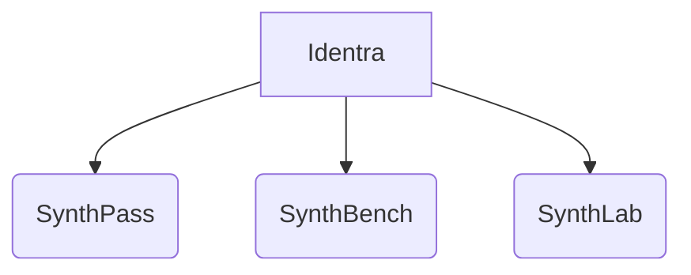

# BRANDING — Identra & SynthPass

> **Status:** foundational document. It defines the brand architecture for the SynthPass
> ecosystem, the stewardship model, naming and repository strategy, the commercial tiers, and
> trademark/IP intent. It is a companion to [`VISION.md`](VISION.md) (the *why*) and
> [`ROADMAP.md`](ROADMAP.md) (the *how*). The mechanical crate rename it implies is specified
> in [`REBRAND_MIGRATION.md`](REBRAND_MIGRATION.md).

## 1. Identra — the steward

**Identra** is the steward brand for the SynthPass ecosystem: a company building *trusted
identity-document AI infrastructure*. In this phase Identra is deliberately a **lightweight
steward**, not a controlling manufacturer — analogous to how the Linux Foundation or the CNCF
support projects without dictating their development.

Identra's responsibilities as steward:

- Governance, release stewardship, and a stable home for the projects.
- Infrastructure (CI, artifact hosting, the demo).
- Intellectual-property policy and trademark protection.
- Community support and contribution acknowledgement.

Vendor neutrality is a guiding principle, especially as commercial offerings appear: the
open-source core remains a trusted resource for everyone regardless of their stack.

## 2. Brand hierarchy

| Brand | Role | Status |
|---|---|---|
| **Identra** | Steward company / platform identity | Present, lightweight |
| **SynthPass** | Identity Document Intelligence Platform (generate + benchmark + extract) | Active — this repository |
| **SynthBench** | Benchmark suite | Planned (grows out of `synthpass-bench`, ROADMAP M4) |
| **SynthLab** | Dataset & adversarial generation | Planned (grows out of `synthpass-gen` + adversarial work) |

All tools share the **`Synth*`** family prefix and a common origin under Identra, while each
keeps a distinct purpose. This convention is codified: new products in the ecosystem take the
`Synth*` name.

## 3. Naming & repository strategy

- **Primary repository:** `synthpass` (currently `multi-level-id-strip`). The rename is an
  intent recorded here and executed per [`REBRAND_MIGRATION.md`](REBRAND_MIGRATION.md).
- **GitHub organisation:** target a dedicated `identra-org` (or similar) to house all
  ecosystem projects, for discoverability and a professional structure. **Declared intent
  only** — no organisation or remote migration is performed as part of adopting these docs.
- **`mrz` stays standalone.** The `mrz` crate is *not* absorbed into the `synthpass-*`
  namespace. It has the potential to become the de-facto Rust MRZ library and should remain
  independent, dependency-light, and separately publishable. Its companion `mrz-wasm` (the
  browser demo) travels with it.
- **Workspace crates** are renamed `mlis-*` → `synthpass-*` (with the new `synthpass-gen` and,
  later, `synthpass-bench`). The full mapping and sequencing are in
  [`REBRAND_MIGRATION.md`](REBRAND_MIGRATION.md).

A formal brand book (logo, colour palette, typography) is deferred; stating the intent to
create one signals commitment to a consistent public identity without over-investing before it
matters.

## 4. Messaging

> **The one-line positioning:**
> *Synthetic identity-document generation for testing, benchmarking, and AI evaluation.*

**Lead with:** testing, validation, benchmarking, AI/ML infrastructure, ground-truth data,
air-gapped and offline operation, compliance-by-design.

**Avoid:** any framing around "passport generation" or "make a fake ID". The product's purpose
is to produce *unmistakably synthetic, watermarked, ground-truthed* documents for evaluating
systems — never to imitate genuine credentials. The generator's mandatory synthetic watermark
and generic non-country template exist to make that true at the artifact level, and the
messaging must match the artifact.

Persona framing:

- **To a data scientist / ML engineer:** "Infinite, perfectly labelled, reproducible training
  and evaluation data for document models — no PII, no data-sharing agreements."
- **To a CISO / compliance lead:** "Air-gapped, deterministic, no PII egress; test your
  identity-verification stack without ever touching real customer documents."

## 5. Commercial strategy

A tiered model keeps the core free while funding long-term sustainability:

| Tier | Audience | What it adds |
|---|---|---|
| **Community (OSS, MIT)** | Everyone | The full generate → benchmark → extract core. Drives adoption and contribution. |
| **Professional SDK** | Teams integrating SynthPass | Higher-capacity generation/extraction knobs, priority support, packaged SDK surfaces. |
| **Enterprise** | Regulated / air-gapped orgs | SSO and advanced security integrations, enhanced reporting, managed/air-gapped deployment support. |
| **Certification · Consulting · Custom models** | Strategic customers | Validation/certification programs, integration consulting, and custom-trained document models. |

The boundary between Community and paid tiers is drawn at *capacity, support, and
enterprise-integration surfaces* — enforced through the existing offline Ed25519 licensing
mechanism (feature-gated, metered, never phoning home) — **not** by withholding the core
capability. Community stays genuinely useful on its own.

## 6. Trademark & IP (intent)

These are stated as intent for the stewardship phase; a full policy follows as the project
matures (modelled on Linux Foundation / Eclipse Foundation practice):

- **Contribution provenance** via a Developer Certificate of Origin (DCO) or CLA, so the
  project has clear rights to distribute contributions under a compatible OSS licence.
- **Trademark usage:** the "SynthPass" and "Identra" names may not be used in third-party
  company/product names or incorporated into other logos; proper attribution is required when
  the brand is referenced.
- **Attribution notice** (standard form):

  > SynthPass is an open-source project under the Identra stewardship.

- Identra reserves the right to review and, where necessary, restrict brand use to protect its
  integrity, so goodwill accrues to the project and its community rather than to unauthorised
  third parties.

---

*This document supersedes the earlier scratch notes
[`rebranding_identra_synthpass.md`](rebranding_identra_synthpass.md); that file remains as the
origin record.*
