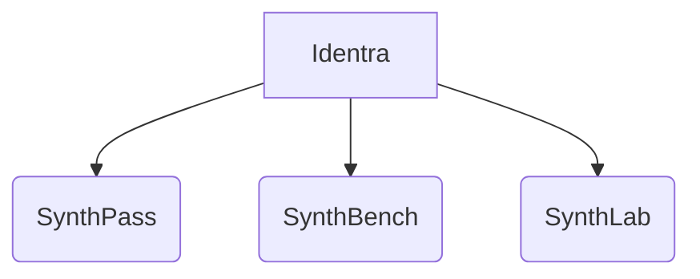

# Foundational Strategy for SynthPass.md

## VISION.md, ROADMAP.md and BRANDING.md core context

### CLaude Sonnet 5 and Opus 4.8 can edit this document when needed.

---

### 1. Architecting a Mature Open-Source Platform_ A Foundational Strategy for SynthPass.md

# Architecting a Mature Open-Source Platform: A Foundational Strategy for SynthPass

## Visionary Direction: Defining the Dual Mission of Technical Sovereignty and Compliance

The development of a comprehensive VISION.md is a foundational step in elevating the SynthPass project from a personal initiative to a professionally managed open-source platform. This document must articulate a clear and compelling "why," serving as the philosophical anchor for all future development, community engagement, and commercial strategy. To meet the ambition of a venture-backed platform, its content and presentation must align with the standards set by mature open-source ecosystems such as the Cloud Native Computing Foundation (CNCF), Kubernetes SIGs, and HashiCorp RFCs. The core directive requires an equal emphasis on two distinct but convergent missions: unwavering commitment to technical sovereignty through offline, deterministic, and air-gapped operation, and explicit alignment with critical regulatory and compliance frameworks like GDPR and ISO standards. Achieving this balance is essential for attracting both technically sophisticated users who prioritize security and control, and enterprise decision-makers who require adherence to legal and industry mandates.

The VISION.md must be structured around this dual-mission philosophy, moving beyond informal prose to adopt a formal, declarative style that signals maturity and strategic intent. Adopting RFC-style headings provides a clear and unambiguous structure, guiding the reader through the project's purpose and direction. Key sections should include "Philosophy," "Long-Term Vision," "Commercial Positioning," and "Compliance Framework". This structure is a hallmark of professional documentation seen in top-tier open-source projects, where clarity and transparency are paramount. For instance, the CNCF's governance framework emphasizes transparency and technical excellence, principles that should be reflected in the VISION.md's content and tone. The document should not merely state goals but declare them as guiding principles. For example, instead of saying "we aim to support offline use," the document should state, "SynthPass is designed from first principles for offline, deterministic, and air-gapped operation." This declarative language establishes a strong, non-negotiable foundation for the project's identity.

The section on technical sovereignty must champion principles of control, predictability, and security. This involves detailing the project's commitment to deterministic generation, ensuring that given the same input parameters, the output is always identical. This feature is crucial for reproducibility in scientific research, financial modeling, and secure development workflows where consistent test data is required. The concept of air-gapped operation should be presented as a core tenet, enabling the generation of synthetic datasets within highly secure environments without any network connectivity. This capability is invaluable for government agencies, defense contractors, and enterprises handling sensitive intellectual property. The philosophy here is one of empowerment through control, allowing users to generate valuable synthetic assets without compromising their most secure environments. This message will resonate deeply with security-conscious engineers and system administrators who are wary of cloud-based solutions that may introduce unforeseen risks or data leakage vectors.

Concurrently, the document must dedicate significant attention to the second mission: trust and compliance by design. This section should move beyond vague statements of intent and provide concrete commitments to how the tool's architecture and features facilitate adherence to regulations. For General Data Protection Regulation (GDPR), this could involve highlighting features that inherently support data minimization, pseudonymization, and the creation of anonymized datasets that can be legally used for testing and development without exposing personal data. The ability to operate air-gapped ensures that no personally identifiable information (PII) ever leaves the controlled environment, a powerful argument for GDPR compliance. Similarly, for ISO standards, particularly ISO/IEC 27001 for Information Security Management Systems, the document should articulate how SynthPass's design supports key ISMS controls related to data confidentiality, integrity, and availability. By framing the tool as a component that helps organizations build compliant infrastructure, its value proposition shifts from a simple utility to an essential part of a robust data governance strategy. This dual positioning creates a unique and powerful value proposition that addresses both the technical and legal needs of modern enterprises.

To enhance readability and signal maturity, the VISION.md should incorporate visual elements and stylistic conventions common in professional open-source documentation. Badges can be used to communicate key attributes at a glance. While SynthPass is not yet part of an incubator program like the CNCF, custom badges can be created to convey its intended purpose, such as "Air-Gapped," "Deterministic Output," or "GDPR Compliant". These serve as immediate signals to potential users about the project's core capabilities. Furthermore, integrating Mermaid.js diagrams can make abstract concepts more tangible. A simple flowchart illustrating the end-to-end workflow of an air-gapped data generation process would be highly effective. Another diagram could contrast a traditional, cloud-dependent synthetic data pipeline with SynthPass's offline-first model, visually reinforcing its core value proposition. Callout blocks, formatted with `> NOTE`, `> VISION`, or `> COMMERCIAL` prefixes, can be used to draw special attention to critical information, philosophical statements, or commercial considerations, breaking up the text and making the document easier to scan.

Finally, the commercial positioning must be clearly articulated, reflecting the ambition of a venture-backed platform. The VISION.md should describe the target market, which includes regulated industries like finance, healthcare, and insurance, as well as government and defense sectors where data sovereignty and security are paramount. It should outline the business model, potentially referencing the funding strategies explored by other successful open-source foundations like The Rust Foundation, which has considered paths such as commercial partnerships and tiered access models. The language should position SynthPass not just as a piece of software, but as a strategic enabler for innovation under constraint. It empowers organizations to leverage the power of synthetic data for AI/ML training, application testing, and research without violating data privacy laws or corporate security policies. By weaving together a compelling narrative of technical excellence, regulatory trustworthiness, and clear commercial applicability, the VISION.md will become a powerful instrument for building a sustainable and impactful open-source ecosystem around SynthPass.

## Execution Blueprint: A Linear Roadmap for Phased Development and Milestone Achievement

The ROADMAP.md serves as the strategic execution blueprint for the SynthPass project, translating the visionary goals outlined in the VISION.md into a tangible, sequential plan of action. The user's directive to present a linear evolution from M1 through M6, without parallel tracks, is a deliberate strategic choice that shapes the narrative of the project's growth. This approach simplifies communication by presenting a clear, logical journey that the community can follow and anticipate. Each milestone builds upon the last, demonstrating a progressive enhancement of capabilities that culminates in a mature, feature-complete platform. This structure is common in product development narratives and effectively manages expectations while showcasing a clear path toward the project's long-term vision.

The roadmap should be meticulously structured around six sequential milestones, with each milestone defined by specific deliverables, a timeline, and a "Definition of Done" (DoD). The DoD is a critical practice borrowed from agile and enterprise software development methodologies; it consists of specific, measurable criteria that signify the completion of all planned work for that milestone. This provides unparalleled transparency and ensures that stakeholders have a shared understanding of what constitutes success at each stage. For example, the DoD for an early milestone might include items like "All core CLI commands are implemented," "Deterministic output is verified via unit tests," and "An end-to-end tutorial is published." As the project matures, the DoD for later milestones would evolve to include more complex requirements, such as "Plugin architecture is fully implemented and documented," "Performance benchmarks against industry standards are published," or "A comprehensive API is available for programmatic access."

Integrating Mermaid architecture diagrams at each major milestone is essential for making the technical progress tangible and understandable to a broad audience. These diagrams should visually represent the architectural changes and additions planned for each phase. For instance, M1 might feature a simple diagram showing the command-line interface interacting with local configuration files and a basic data generator module. By M3, a new diagram could illustrate the introduction of a plugin architecture, showing how various data generators (e.g., for SQL databases, NoSQL stores, or specific data formats) can be dynamically loaded. In M5, the diagram might expand to show the integration of a new component, such as a data quality validation engine, or a reporting module. These visual aids transform the roadmap from a static list of tasks into a dynamic story of architectural evolution, helping contributors and users visualize the project's trajectory.

| Milestone | Target Timeline | Key Deliverables | Definition of Done (DoD) |
| --- | --- | --- | --- |
| **M1: Core Engine & CLI**  | Q3 2026

 | - Stable core library for deterministic data generation.

 

 - Basic Command-Line Interface (CLI) with essential commands.

 

 - First end-to-end tutorial.

 | - All core generation functions produce repeatable outputs.

 

 - CLI is documented and functional for basic use cases.

 

 - Tutorial successfully guides a user from installation to generating their first dataset.

 |
| **M2: Storage & Format Support**  | Q4 2026

 | - Support for multiple data storage backends (e.g., local files, S3-compatible object stores).

 

 - Export to several common data formats (e.g., CSV, Parquet, JSON).

 | - Backends and formats are tested and stable.

 

 - Configuration for backend and format selection is flexible and well-documented.

 

 - Performance benchmarks for different formats are available.

 |
| **M3: Plugin Architecture**  | Q4 2026

 | - Formal plugin interface for data sources and generators.

 

 - A working example plugin for a popular database type.

 

 - Updated developer documentation for creating plugins.

 | - Plugin interface is stable and well-defined.

 

 - Third-party developers can create and integrate a custom plugin following the documentation.

 

 - Example plugin is actively maintained and used in tutorials.

 |
| **M4: Advanced Generation Logic**  | Q1 2027

 | - Implementation of more sophisticated data generation techniques (e.g., sequence-aware generation, cross-field relationships).

 

 - A dedicated module for managing generation rules.

 | - Rules engine is capable of defining complex dependencies between fields.

 

 - Sample datasets demonstrate realistic relational integrity.

 

 - Rule syntax is documented and validated.

 |
| **M5: Quality Assurance & Governance**  | Q1 2027

 | - A data quality validation framework with predefined checks.

 

 - An audit trail feature for tracking generation jobs and parameters.

 

 - Integration with common CI/CD pipelines.

 | - Validation framework includes at least five standard checks (e.g., null ratios, uniqueness, range checks).

 

 - Audit trail logs are complete and tamper-evident.

 

 - CI/CD integration is documented and functional.

 |
| **M6: Enterprise Readiness**  | Q2 2027

 | - Secure air-gapped deployment guide.

 

 - RBAC (Role-Based Access Control) implementation.

 

 - A closed beta for a commercial "Pro" edition with advanced features.

 | - Air-gapped deployment is fully tested and documented.

 

 - RBAC allows fine-grained control over user permissions.

 

 - Feedback from the Pro edition beta is collected and prioritized for future development.

 |

Beyond the detailed milestones, the ROADMAP.md must include a "Future Work" section. This forward-looking segment is crucial for demonstrating that the project has a long-term vision that extends beyond the current roadmap. It can hint at capabilities years away, such as "Integration with distributed computing frameworks like Apache Spark," "Support for generative AI models to create novel synthetic patterns," or "Advanced statistical analysis tools for dataset characterization." This section reassures long-term contributors, potential partners, and investors that SynthPass is not a short-lived project but a platform with sustained momentum and ambition. It reflects the kind of strategic planning expected of a mature, venture-backed entity. By combining a clear, linear narrative with specific deliverables, measurable definitions of success, visual architectural guidance, and a glimpse into the future, the ROADMAP.md becomes an indispensable artifact for guiding the project's development and communicating its strategic direction to the entire ecosystem.

## Brand Architecture: Establishing a Scalable Identity for a Multi-Product Ecosystem

The BRANDING.md document is the cornerstone for architecting a scalable and coherent brand identity for the SynthPass ecosystem, addressing the user's vision for a future platform encompassing SynthPass, SynthBench, and SynthLab. This document must strategically define the relationship between the steward, Identra, and the open-source projects, while establishing a clear and consistent framework for naming, repositories, and commercial offerings. Its primary function is to move beyond a single-product focus and lay the groundwork for a multi-tool platform, thereby setting the stage for future growth and diversification. This requires a careful balance between positioning Identra as a lightweight, supportive steward in the present and outlining its evolution into the central identity of a broader technology suite in the future.

The concept of Identra as a "lightweight steward brand" is a mature and strategic positioning for the initial phase of the project. This role is analogous to that of major open-source foundations like The Linux Foundation or The Eclipse Foundation, which support projects without direct manufacturing control. As stewards, organizations provide critical services such as governance, infrastructure management, intellectual property (IP) policy enforcement, and community support, allowing the project to thrive independently and neutrally. The BRANDING.md should explicitly define this stewardship model, clarifying that Identra's role is to nurture the project's health and sustainability, not to dictate its development. This approach fosters trust within the community by adhering to principles of vendor neutrality, a core tenet of foundations like the CNCF. Acknowledging contributions and providing a stable home for the project are key responsibilities of a steward, and these should be highlighted as Identra's primary functions during this phase.

To visualize the long-term vision, the BRANDING.md should feature a simple Mermaid diagram that illustrates the relationship between Identra and its constituent projects. This graphical representation makes the multi-tool strategy instantly comprehensible and reinforces the unified brand family.

(Diagram mapping the relationship architecture between Identra and its multi-product suite)

This diagram communicates that all tools share a common origin and are supported under the Identra umbrella, while each maintains its own distinct identity and purpose. This architecture is scalable and provides a clear blueprint for future expansion. The naming convention, using the "Synth*" prefix, is a strong choice that creates a cohesive family brand, making it easy for users to identify all tools as part of the same ecosystem. The document should formally codify this convention to ensure consistency across all future projects.

A practical and forward-looking aspect of the BRANDING.md is the inclusion of a high-level plan for repository migration. This demonstrates a move towards a more organized and professional project structure. The plan should outline the intention to create a new GitHub organization, tentatively named `identra-org`, to house all related projects. This centralized location would streamline collaboration, improve discoverability, and provide a professional appearance that mirrors large-scale open-source operations. The document should also touch upon the branding guidelines for logos and colors, drawing inspiration from established open-source entities. For example, it could specify a primary color palette and typography, similar to how the CNCF uses 'Clarity City' font and OpenSSF uses IBM Plex Sans and Cairo. While the full guidelines can be developed later, stating the intention to create a formal brand book signals a commitment to a polished and consistent public identity.

Furthermore, the BRANDING.md must clarify the commercial strategy, differentiating between the open-source project and any potential commercial offerings. This is crucial for maintaining community trust while building a viable business. The open-source version of SynthPass should be positioned as a powerful community edition, fostering adoption and contribution. The document should then introduce the concept of a commercial "Pro" or "Enterprise" edition, offering additional features tailored to paying customers. Potential features for a commercial edition could include advanced security integrations (e.g., SSO), enhanced reporting and analytics dashboards, priority support, or managed service components. This tiered approach, similar to models considered by The Rust Foundation, allows the project to generate revenue for its long-term sustainability while keeping the core technology freely available. The BRANDING.md should provide a clear messaging guide, defining terms like "Community Edition" and "Enterprise Edition" and explaining the benefits of each to different personas, such as a data scientist versus a Chief Information Security Officer (CISO). This ensures that marketing communications remain consistent and accurately represent the project's dual nature as both a community-driven open-source endeavor and a commercially supported platform.

## Governance and Professionalism: Aligning with Open-Source Best Practices

Achieving the ambition of a mature, venture-backed open-source platform necessitates more than just polished documentation; it requires a deep-seated commitment to the principles and practices that govern successful open-source ecosystems. The VISION.md, ROADMAP.md, and BRANDING.md collectively form the initial layer of SynthPass's governance framework, but they must be built upon a foundation of established best practices from leading organizations like the CNCF, The Linux Foundation, and The Eclipse Foundation. This involves embracing transparency, meritocracy, vendor neutrality, and technical excellence as core operating principles. Adopting these standards is not merely cosmetic; it is fundamental to building trust, fostering a healthy community, and ensuring the long-term sustainability of the project.

The CNCF's governance framework provides an excellent model for structuring community-driven development. Its five foundational principles—Transparency, Meritocracy, Vendor Neutrality, Community-Driven decision-making, and Technical Excellence—are universally applicable. The VISION.md and ROADMAP.md, by being publicly accessible and clearly articulating the project's goals and path forward, embody the principle of Transparency. The roadmap's clear Definition of Done criteria operationalizes the focus on Technical Excellence. To further embrace Meritocracy, the project should establish clear pathways for contributors to earn leadership roles based on their contributions, mirroring the CNCF's system of elected TAG Chairs, Tech Leads, and Subproject Leads. Vendor Neutrality must be a guiding light, especially as the project considers commercial offerings. The BRANDING.md's emphasis on Identra as a steward rather than a controlling manufacturer is a crucial first step in this direction, ensuring the project remains a trusted resource for all, regardless of their technology stack.

Intellectual Property (IP) management is another area where adopting established practices is critical for long-term health. The Eclipse Foundation provides a comprehensive template for IP governance through its IP Policy, which covers everything from accepting contributions to licensing code. The BRANDING.md should state the project's intention to implement a similar robust IP policy, likely under the stewardship of the Identra organization. This policy would typically require contributors to sign a Contributor License Agreement (CLA) or use a Developer Certificate of Origin (DCO), ensuring that the project has the right to distribute the code and that contributions are made under a compatible open-source license. This practice protects the project from future legal challenges and provides contributors with confidence that their work is being handled responsibly. The Eclipse Foundation’s extensive collection of policies covering conduct, security, and licensing offers a blueprint for the comprehensive governance framework that a mature project will eventually need.

Brand protection and trademark usage are also integral components of a professional open-source project. The Linux Foundation and The Open Source Security Foundation (OpenSSF) have strict guidelines governing the use of their trademarks to prevent misuse and ensure consistent messaging. The BRANDING.md should begin to codify these rules for the nascent SynthPass brand. This includes prohibiting the use of the "SynthPass" name in company or product names, preventing its incorporation into other logos, and requiring proper attribution notices when the brand is mentioned. For example, a standard attribution notice could read: "SynthPass is an open-source project under the Identra stewardship. See identra.dev for more information." These rules protect the brand's integrity and ensure that goodwill derived from its use accrues to the project and its community, not to unauthorized third parties. The Linux Foundation reserves the right to review and terminate any use at any time, a principle that should be adopted by Identra to maintain control over its brand assets.

By embedding these governance and professionalism principles into its foundational documents, SynthPass can systematically build the institutional structures necessary to scale. The VISION.md sets the philosophical course, the ROADMAP.md charts the execution, and the BRANDING.md defines the identity. Together, they create a strategic triad that, when combined with a robust underlying governance framework modeled on proven open-source examples, transforms the project from a promising tool into a resilient and respected platform. This disciplined approach to governance is what distinguishes serious, long-lasting open-source initiatives from fleeting hobby projects and is the ultimate enabler of the venture-backed ambition articulated by the user.

## Synthesis and Strategic Recommendations

The transformation of the SynthPass project into a mature, venture-backed open-source platform hinges on the meticulous creation and implementation of three foundational strategy documents: VISION.md, ROADMAP.md, and BRANDING.md. These artifacts collectively constitute a strategic manifesto that moves the project beyond ad-hoc development notes into a structured, professional, and community-focused endeavor. The analysis reveals that each document plays a distinct yet interconnected role in achieving this ambitious goal, aligning the project with the standards and maturity levels of premier open-source ecosystems like the CNCF, The Linux Foundation, and The Rust Foundation.

The **VISION.md** establishes the "why" by articulating a dual-mission philosophy. It must give equal weight to the twin pillars of technical sovereignty—emphasizing offline, deterministic, and air-gapped operation—and regulatory compliance, specifically targeting frameworks like GDPR and ISO standards. This duality is a powerful value proposition, appealing to both security-conscious technologists and enterprise decision-makers in regulated industries. By adopting the formal, declarative language and structural conventions of RFCs and foundation-level documentation, the VISION.md will immediately signal a higher level of ambition and professionalism, replacing informal prose with a clear statement of purpose. The integration of visual elements like Mermaid diagrams and badges will further enhance its impact, making abstract principles like air-gapped security tangible and communicable at a glance.

The **ROADMAP.md** outlines the "how," providing a transparent and credible path toward realizing the vision. The user's directive for a linear, phased progression from M1 to M6 is a strategic narrative device that simplifies communication and builds anticipation. Each milestone must be defined not only by its deliverables but also by a rigorous "Definition of Done," ensuring clarity and manageability. The integration of Mermaid architecture diagrams at each stage will visually chart the project's technical evolution, making the roadmap a living document that guides both internal development and external community understanding. The inclusion of a "Future Work" section demonstrates foresight and long-term planning, a critical attribute for attracting sustained interest and investment. This document transforms a simple list of features into a strategic blueprint for growth.

The **BRANDING.md** defines the "who and what," architecting a scalable brand identity that accommodates both the current reality and the future ambition. It must clearly position Identra as a lightweight steward in the present, a role that builds trust and adheres to principles of vendor neutrality. Simultaneously, it must lay the conceptual groundwork for Identra's evolution into the central platform identity for an expanding ecosystem of tools, including SynthPass, SynthBench, and SynthLab. This is achieved through a coherent brand architecture, consistent naming conventions, and a high-level plan for repository management. The document also serves to delineate commercial strategy, introducing the concept of tiered offerings (community vs. enterprise) and establishing foundational policies for trademark and IP management, thus protecting the brand's integrity as it grows.

In synthesis, these three documents are not standalone files but the foundational layers of a new organizational culture for SynthPass. They codify a commitment to transparency, community-driven development, and technical excellence—all hallmarks of successful open-source platforms. By implementing these recommendations, the project can effectively shed its "hobby project" origins and take its place as a serious contender in the synthetic data space, equipped with the strategic clarity and professional documentation needed to attract contributors, users, and ultimately, the investment required for its long-term success.

---

### 2. synthpass_v2_0_regenerated.md

# SynthPass v2.0 Roadmap (M3 → M5)

## Vision

SynthPass is an offline, air-gapped identity document intelligence platform.
Its competitive advantage is **synthetic, deterministic, perfectly-labelled data**.

The long-term goal is not simply better OCR, but ownership of the complete document-AI lifecycle:

Synthetic documents → Ground truth → Benchmarking → OCR → MRZ → AI extraction → Continuous improvement.

## M3 – Synthetic Document Factory

### Objectives

* Deterministic synthetic document generation.

* Rich fictional identities (never real PII).

* Capture profiles (mobile, scanner, worn document, border control).

* Modular degradation pipeline.

* Parallel generation.

* Automatic MRZ validation.

* Optional full Tier-1/Tier-2 validation.

### Deliverables

* `synthpass-gen`

* `synthpass generate`

* JSON metadata

* Reproducible seeds

* Capture profiles

* Watermarking

## M4 – Regression & Benchmarking

### Objectives

* Golden datasets.

* Continuous regression testing.

* Performance benchmarking.

* Adversarial red-team generation.

* Documentation and licensing.

### Deliverables

* `synthpass bench`

* CI quality gates

* Benchmark reports

* `docs/SYNTHPASS.md`

* `docs/ADVERSARIAL.md`

## M5 – Platform Expansion

### Objectives

* TD1, TD2, MRVA/MRVB.

* Declarative layouts.

* Dataset exports (COCO, YOLO, JSONL, HF).

* Fine-tuning dataset generation.

* Plugin architecture.

### Commercial direction

* OSS

* Professional SDK

* Enterprise

* Certification

* Consulting

* Custom models

---

### 3. rebranding_identra_synthpass_regenerated.md

# Rebranding Strategy

## Identra (Company)

Building trusted identity-document AI infrastructure.

### Products

* SynthPass — Identity Document Intelligence Platform

* SynthBench — Benchmark Suite

* SynthLab — Dataset & Adversarial Generation

## Repository Strategy

Repository:
`synthpass`

Keep the standalone crate:
`mrz`

Reason:
`mrz` has the potential to become the de-facto Rust MRZ library and should stay independent.

### Workspace example:

* mrz

* synthpass-core

* synthpass-ocr

* synthpass-llm

* synthpass-cli

* synthpass-gen

* synthpass-bench

## Brand hierarchy

Identra
├── SynthPass
├── SynthBench
└── SynthLab

## Messaging

**Synthetic identity document generation for testing, benchmarking and AI evaluation.**

Avoid marketing around "passport generation". Focus on testing, validation, benchmarking, and AI infrastructure.

## Commercial roadmap

* OSS

* Professional SDK

* Enterprise

* Certification

* Consulting

* Custom AI Models

## Long-term objective

Become the industry benchmark for offline identity-document AI.