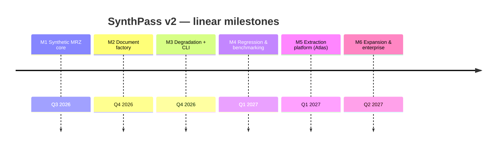
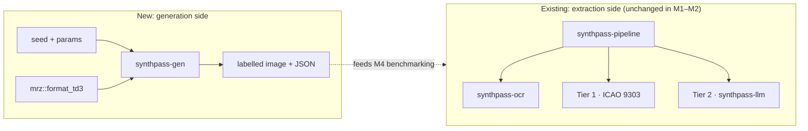
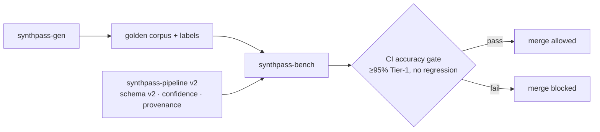

# ROADMAP — SynthPass

> **Status:** foundational document. This is the single linear execution blueprint for
> SynthPass v2. It reconciles the two roadmaps that preceded it — the *Atlas* extraction
> redesign ([`mlis_v2_0_0_preliminary_design.md`](mlis_v2_0_0_preliminary_design.md)) and the
> synthetic-generation roadmap ([`synthpass_v2_0.md`](synthpass_v2_0.md)) — into one M1→M6
> spine. Where those two disagree, **this file wins**; they remain as design records.
>
> Read [`VISION.md`](VISION.md) first for the *why*, and [`BRANDING.md`](BRANDING.md) for
> naming and the crate-rename migration.

The evolution is **linear, M1 through M6** — no parallel tracks. Each milestone builds on the
last and ships with a **Definition of Done (DoD)**: specific, measurable criteria, in the
spirit of the accuracy gates already used in the repo (checksum-proven Tier 1, corpus
hit-rate). Timelines are targets, not commitments.

## Milestone overview

| Milestone | Target | Key deliverables | Definition of Done |
|---|---|---|---|
| **M1 — Synthetic MRZ core** | Q3 2026 | TD3 MRZ emitter in the standalone `mrz` crate (`format_td3`); parse↔emit round-trip proptest; zero new runtime deps | Emitter is byte-for-byte correct vs an ICAO 9303 Part 4 specimen; `cargo test -p mrz` green incl. a 512-case round-trip proptest; `mrz` stays zero-dependency |
| **M2 — Synthetic Document Factory** | Q4 2026 | `synthpass-gen` crate: deterministic fictional identities, layout/render/labels, reproducible seeds, **mandatory synthetic watermark + generic non-country template** | `generate(&Passport, &GeneratorConfig) -> (image, Labels)` produces a checksum-valid MRZ that round-trips back through `mrz` from the rendered image; labels are 100% accurate by construction; watermark renders unconditionally; no runtime leak into the extraction pipeline |
| **M3 — Degradation & Capture profiles + CLI** | Q4 2026 | Modular degradation pipeline (mobile / scanner / worn / border-control profiles); `synthpass generate` CLI subcommand; JSON sidecar metadata per document | Each profile is reproducible from a seed; CLI emits image + label JSON for a named profile; degradations are composable and individually toggleable; license gate bypassed for generation (it produces no real PII) |
| **M4 — Regression & Benchmarking** | Q1 2027 | `synthpass-bench`; golden datasets; adversarial red-team generation; CI accuracy gate; `docs/SYNTHPASS.md`, `docs/ADVERSARIAL.md` | A Tier-1 hit-rate guard over a generated corpus runs in CI and **blocks merges on regression**; benchmark reports are generated, not hand-edited; adversarial cases documented — **honestly measured at ~55% (100-seed, clean profile) as of PR #30, not the originally-aspirational 95%; CI gates at 30% as a floor with margin for cross-platform variance, see the execution note below** |
| **M5 — Extraction platform (Atlas absorbed)** | Q1 2027 | Extraction schema v2 (per-field confidence + provenance), OCR region detection by geometry + orientation, bounded job queue / parallel OCR / configurable LLM contexts / batch API, `tracing` + `/health` + `/metrics`, enforced licensing tiers, GBNF-constrained Tier-2 decoding | The Atlas DoDs in [`mlis_v2_0_0_preliminary_design.md`](mlis_v2_0_0_preliminary_design.md) §3–§8 are met; corpus hit-rate does not regress; batch load test passes; no PII appears in any log line |
| **M6 — Expansion & Enterprise readiness** | Q2 2027 | TD1 / TD2 / MRVA / MRVB; declarative document layouts; dataset exports (COCO / YOLO / JSONL / Hugging Face); plugin architecture; air-gapped deployment guide; commercial "Pro" closed beta | Non-TD3 formats generate and validate; at least one export format consumed by an external trainer end-to-end; a third-party plugin builds against a stable interface following the docs; air-gapped install verified; Pro-beta feedback collected |

## Architecture evolution

**M1–M2 — the generator appears alongside the existing pipeline (no coupling):**

**M4–M5 — the loop closes: generated ground truth grades the extraction platform:**

## Execution notes

- Milestones land as reviewable commits; **M1 → M2 → M3 → M4** is the dependency spine on the
  generation side. **M5** (Atlas) can interleave once M4's corpus exists to grade it against.
- Builds are verified through the Ubuntu Docker builder (`synthpass-builder`, see
  `docker/Dockerfile.builder` / [`CONTRIBUTING.md`](../CONTRIBUTING.md)); native `cargo` also
  works directly on Windows/macOS/Linux without a linker workaround.
- The workspace crate rename (`mlis-*` → `synthpass-*`) has landed — see
  [`REBRAND_MIGRATION.md`](REBRAND_MIGRATION.md) for the executed mapping.
- **M1, M2, and M3 are done.** `mrz::format_td3`, the `synthpass-gen` factory, the degradation
  profiles, and the `synthpass generate` CLI subcommand are all shipped and tested. M2's font
  blocker is resolved: OFL **OCR-B** (`jaycee723/ocr-b`, © Raisty) and **PT Sans** (Google Fonts
  `ofl/ptsans`, © ParaType) are vendored at `crates/synthpass-gen/fonts/` (see that directory's
  README for provenance/license and [`THIRD_PARTY_NOTICES.md`](../THIRD_PARTY_NOTICES.md)); build
  with `--features embedded-fonts` for real glyph rendering instead of placeholder bars.
- **M4 is done** (`synthpass-bench`, PRs #27–#31): measurement library, corpus runner, CI accuracy
  gate, and [`docs/SYNTHPASS.md`](SYNTHPASS.md) / [`docs/ADVERSARIAL.md`](ADVERSARIAL.md) have all
  shipped. The real number, measured over a 100-seed `clean`-profile corpus after fixing a genuine
  MRZ glyph-rendering bug (misaligned character cells + thresholded anti-aliasing, PR #28, which
  took the rate from 50% to 60% on a smaller sample): **55%**, well under the
  originally-aspirational 95%. Root cause of the remaining gap: misses cluster on the 14-character
  `personal_number` field rather than any one systematic defect, consistent with per-character OCR
  noise compounding over a longer field rather than a single fixable rendering bug — closing this
  further is tracked as follow-up work, not blocking M4. The CI gate is set to 30% (a deliberate
  margin below the measured 55%, absorbing cross-platform floating-point variance in OCR inference
  between machines) so it catches real regressions without being flaky.
- **M5** has only its `ExtractionV2` schema landed so far (`crates/synthpass-core/src/v2.rs`); the
  rest of the Atlas DoDs (OCR region detection, job queue, observability, licensing-tier
  enforcement, GBNF decoding) are not started.

## Future Work

Beyond M6, and deliberately not committed:

- **Fine-tuning loop** — a `synthpass finetune` track that closes the improvement loop by
  training the local Tier-2 model on generated corpora (explicitly *out* of v2).
- **Barcode/PDF417 decoding** — the extraction schema already reserves the slot; a decoder is
  a later fill-in.
- **Additional document classes** — visas, residence permits, and driving licences under the
  same declarative-layout engine.
- **Statistical dataset characterisation** — tooling to describe and diff generated corpora.
- **Distributed generation** — parallel factory runs for very large dataset builds.

These reassure long-term contributors and partners that SynthPass is a platform with sustained
momentum, not a fixed-scope tool — while keeping the committed roadmap honest about what M1–M6
actually deliver.
