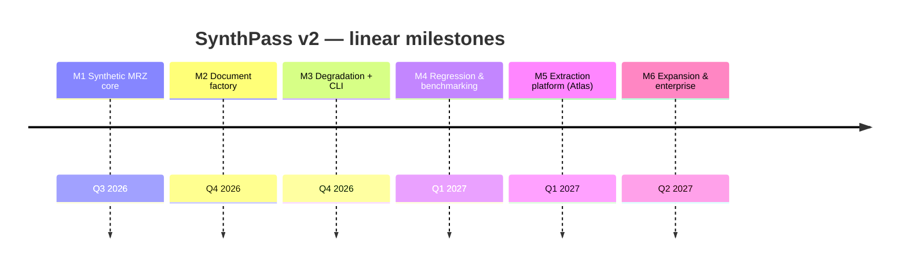
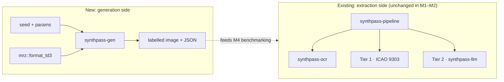
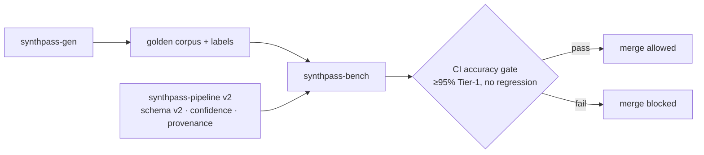

# ROADMAP — SynthPass

> **Status:** foundational document. This is the single linear execution blueprint for
> SynthPass v2. It reconciles the two roadmaps that preceded it — the *Atlas* extraction
> redesign ([`mlis_v2_0_0_preliminary_design.md`](mlis_v2_0_0_preliminary_design.md)) and the
> synthetic-generation roadmap ([`synthpass_v2_0.md`](synthpass_v2_0.md)) — into one M1→M6
> spine. Where those two disagree, **this file wins**; they remain as design records.
>
> Read [`VISION.md`](VISION.md) first for the *why*, and [`BRANDING.md`](BRANDING.md) for
> naming and the crate-rename migration.

The evolution is **linear, M1 through M6** — no parallel tracks. Each milestone builds on the
last and ships with a **Definition of Done (DoD)**: specific, measurable criteria, in the
spirit of the accuracy gates already used in the repo (checksum-proven Tier 1, corpus
hit-rate). Timelines are targets, not commitments.

## Milestone overview

| Milestone | Target | Key deliverables | Definition of Done |
|---|---|---|---|
| **M1 — Synthetic MRZ core** | Q3 2026 | TD3 MRZ emitter in the standalone `mrz` crate (`format_td3`); parse↔emit round-trip proptest; zero new runtime deps | Emitter is byte-for-byte correct vs an ICAO 9303 Part 4 specimen; `cargo test -p mrz` green incl. a 512-case round-trip proptest; `mrz` stays zero-dependency |
| **M2 — Synthetic Document Factory** | Q4 2026 | `synthpass-gen` crate: deterministic fictional identities, layout/render/labels, reproducible seeds, **mandatory synthetic watermark + generic non-country template** | `generate(&Passport, &GeneratorConfig) -> (image, Labels)` produces a checksum-valid MRZ that round-trips back through `mrz` from the rendered image; labels are 100% accurate by construction; watermark renders unconditionally; no runtime leak into the extraction pipeline |
| **M3 — Degradation & Capture profiles + CLI** | Q4 2026 | Modular degradation pipeline (mobile / scanner / worn / border-control profiles); `synthpass generate` CLI subcommand; JSON sidecar metadata per document | Each profile is reproducible from a seed; CLI emits image + label JSON for a named profile; degradations are composable and individually toggleable; license gate bypassed for generation (it produces no real PII) |
| **M4 — Regression & Benchmarking** | Q1 2027 | `synthpass-bench`; golden datasets; adversarial red-team generation; CI accuracy gate; `docs/SYNTHPASS.md`, `docs/ADVERSARIAL.md` | A Tier-1 hit-rate guard over a generated corpus runs in CI and **blocks merges on regression**; benchmark reports are generated, not hand-edited; adversarial cases documented — **honestly measured at ~55% (100-seed, clean profile) as of PR #30, not the originally-aspirational 95%; CI gates at 30% as a floor with margin for cross-platform variance, see the execution note below** |
| **M5 — Extraction platform (Atlas absorbed)** | Q1 2027 | Extraction schema v2 (per-field confidence + provenance), OCR region detection by geometry + orientation, bounded job queue / parallel OCR / configurable LLM contexts / batch API, `tracing` + `/health` + `/metrics`, enforced licensing tiers, GBNF-constrained Tier-2 decoding | The Atlas DoDs in [`mlis_v2_0_0_preliminary_design.md`](mlis_v2_0_0_preliminary_design.md) §3–§8 are met; corpus hit-rate does not regress; batch load test passes; no PII appears in any log line |
| **M6 — Expansion & Enterprise readiness** | Q2 2027 | TD1 / TD2 / MRVA / MRVB; declarative document layouts; dataset exports (COCO / YOLO / JSONL / Hugging Face); plugin architecture; air-gapped deployment guide; commercial "Pro" closed beta | Non-TD3 formats generate and validate; at least one export format consumed by an external trainer end-to-end; a third-party plugin builds against a stable interface following the docs; air-gapped install verified; Pro-beta feedback collected |

## Architecture evolution

**M1–M2 — the generator appears alongside the existing pipeline (no coupling):**

**M4–M5 — the loop closes: generated ground truth grades the extraction platform:**

## Execution notes

- Milestones land as reviewable commits; **M1 → M2 → M3 → M4** is the dependency spine on the
  generation side. **M5** (Atlas) can interleave once M4's corpus exists to grade it against.
- Builds are verified through the Ubuntu Docker builder (`synthpass-builder`, see
  `docker/Dockerfile.builder` / [`CONTRIBUTING.md`](../CONTRIBUTING.md)); native `cargo` also
  works directly on Windows/macOS/Linux without a linker workaround.
- The workspace crate rename (`mlis-*` → `synthpass-*`) has landed — see
  [`REBRAND_MIGRATION.md`](REBRAND_MIGRATION.md) for the executed mapping.
- **M1, M2, and M3 are done.** `mrz::format_td3`, the `synthpass-gen` factory, the degradation
  profiles, and the `synthpass generate` CLI subcommand are all shipped and tested. M2's font
  blocker is resolved: OFL **OCR-B** (`jaycee723/ocr-b`, © Raisty) and **PT Sans** (Google Fonts
  `ofl/ptsans`, © ParaType) are vendored at `crates/synthpass-gen/fonts/` (see that directory's
  README for provenance/license and [`THIRD_PARTY_NOTICES.md`](../THIRD_PARTY_NOTICES.md)); build
  with `--features embedded-fonts` for real glyph rendering instead of placeholder bars.
- **M4 is done** (`synthpass-bench`, PRs #27–#31): measurement library, corpus runner, CI accuracy
  gate, and [`docs/SYNTHPASS.md`](SYNTHPASS.md) / [`docs/ADVERSARIAL.md`](ADVERSARIAL.md) have all
  shipped. The real number, measured over a 100-seed `clean`-profile corpus after fixing a genuine
  MRZ glyph-rendering bug (misaligned character cells + thresholded anti-aliasing, PR #28, which
  took the rate from 50% to 60% on a smaller sample): **55%**, well under the
  originally-aspirational 95%. ~~Root cause of the remaining gap: misses cluster on the
  14-character `personal_number` field rather than any one systematic defect.~~ **That inference
  has since been measured and refuted** — see the per-field CER note below; `personal_number`
  runs a 25% CER, mid-pack. It was a reasonable reading of a binary signal, and it is simply not
  what the data says once the signal stops being binary. The CI gate is set to 30% (a deliberate
  margin below the measured 55%, absorbing cross-platform floating-point variance in OCR inference
  between machines) so it catches real regressions without being flaky.
- **M5's `ExtractionV2` schema is landed** (`crates/synthpass-core/src/v2.rs`), and a
  **safe-batch kickoff of six small, independently-safe, zero-new-dependency slices has since
  shipped on top of it (PRs #33–#37)**: `synthpass-license` now actually enforces
  `mlis_min_version` in `check()` instead of just parsing it (PR #33); the v1→v2 lift scores
  confidence **per-field** rather than one flat number (PR #34); `synthpass-serve` gained a
  `GET /health` endpoint, deliberately outside the auth middleware since health probes are
  typically unauthenticated (PR #35); the Tier-2 concurrency semaphore is now configurable via
  `SYNTHPASS_LLM_CONTEXTS` instead of hardcoded to 1 (PR #36); and the queue-full 503 now carries
  a `Retry-After: 5` header, distinct from the (non-retriable) license-expired 503 (PR #37).
- **M5 licensing enforcement (Atlas §7) has landed.** `synthpass_license::check_feature` +
  `LicenseError::FeatureNotLicensed` make the `features` list load-bearing, a `Tier` enum supplies
  the `trial`/`pro`/`enterprise` presets from [`BRANDING.md`](BRANDING.md) §5, and a new
  `max_llm_contexts` payload field meters Tier-2 concurrency (env asks, license permits, effective
  = min, and `synthpass-serve` says so out loud when it lowers the request). Legacy licenses with
  no `features` list are grandfathered into everything (break B6). The per-*endpoint* half of this
  gate — 403ing a named surface — lands with the surfaces themselves: `metrics` with `/metrics`,
  `batch` with the batch API, rather than as a middleware with nothing yet to guard.
  The remaining Atlas DoDs are tracked below.
- **M5 observability (Atlas §6, and §5's `/metrics` half) has landed.** `tracing` replaces every
  request-path `println!`, `/api/extract` opens a `request_id`-bearing span, and `synthpass-serve`
  serves Prometheus text at `GET /metrics` — inside the auth layer and gated on the `metrics`
  license feature, so the per-endpoint half of the licensing gate now has its first real consumer.
  Counters cover documents by tier and stage failures; latency histograms cover the OCR and Tier-2
  stages; queue depth is a gauge. **One new dependency** (`tracing-subscriber`), justified in
  [`CHANGELOG.md`](../CHANGELOG.md) and in the `[workspace.dependencies]` comment; no metrics
  crate — the exposition format is hand-rolled.
  The **"no PII in any log line" DoD is now an executable test**
  (`crates/synthpass-pipeline/tests/pii_logging.rs`) rather than a convention, and the rule is
  codified as a review checklist in [`CONTRIBUTING.md`](../CONTRIBUTING.md). Writing it surfaced a
  trap worth recording: `tracing` caches callsite interest process-globally, so the same assertions
  inside the library passed *vacuously* — capturing nothing — once sibling tests had already driven
  those callsites. It lives in its own test binary and asserts the harness captured something
  before asserting what it did not contain.
- **M5 GBNF-constrained Tier-2 decoding (Atlas §8) has landed — with a flat accuracy result,
  recorded honestly.** `synthpass-llm` generates its GBNF from `prompt::FIELDS` (so prompt and
  grammar cannot drift), constrains JSON *structure* only, and demotes `repair.rs` to a fallback
  behind a `needs_repair()` / `repair_fallbacks()` measurement. Measured A/B over the 6-document
  parity corpus on qwen2.5-1.5b-instruct-q4_k_m: **repair fallbacks 2 → 0** (Atlas §8's stated
  criterion, met), **field match rate unchanged at 19/42 (45.2%)**, **wall time +55%** (102s →
  158s). Repair had already been salvaging those two documents, so eliminating the parse-failure
  class bought robustness rather than accuracy — precisely the risk
  [`mlis_v2_0_0_preliminary_design.md`](mlis_v2_0_0_preliminary_design.md) §12 named. It ships on
  by default (`SYNTHPASS_LLM_GRAMMAR=0` opts out) because unrepresentable-by-construction beats
  repaired-after-the-fact, and the latency lands only on the Tier-2 path that runs when Tier 1 has
  already failed. Revisiting with a larger GGUF is Future Work, not an M5 gate.
  Landing it also uncovered and fixed a latent double-accept in the sampling loop that had been
  harmless only because every sampler in the chain was stateless.
- **M5 is complete — every Atlas DoD in §3–§8 has landed.** The last two closed as follows.
  The **bounded job queue / parallel OCR / batch API** (`Pipeline::submit`/`JobHandle`,
  `POST /api/extract/batch`, `GET /api/jobs/{id}`) shipped in PR #49, with the OCR geometry API
  and deterministic field normalizers in #48 and their wiring into `ExtractionV2` in #50.

  **OCR region detection by geometry + orientation** shipped last, and its orientation half is
  worth recording honestly because the first design was wrong in an instructive way.
  `detect_mrz_band` scores a line group on *recognized text* — MRZ-charset density, ICAO line
  length, OCR-B glyph aspect — so the obvious 0°/180° rule ("the MRZ sits at the bottom on every
  ICAO layout, so a confident band near the top means the page is upside down") is circular: on a
  genuinely inverted page the real MRZ is garbled and scores *low*, unrelated mid-page noise wins
  the band instead, and the band's position then describes the noise rather than the MRZ. It
  measurably did not fire on the one specimen it was written for.

  What replaced it is a comparison, not a guess: score the band on the page *and* on its 180°
  flip, keep the better. Measured over the 42-image `samples/` corpus scored in both
  orientations, that gets the direction right on **41 of 42 with zero false flips**. Both
  constants come out of the sweep rather than intuition — a 1.2× margin (mirroring
  `ROTATION_MARGIN`'s existing "ties leave it alone" bias) is cleared by every genuine correction
  (narrowest 1.27×, most 2–5×) while suppressing the corpus's one wrong-direction vote and its
  four exact ties, and a 0.75 confidence bar skips the extra pass entirely when the upright band
  is already stronger than any inverted page in the corpus managed (0.7132). The sweep also ruled
  out the cheaper design of thresholding a single orientation: inverted scores overlap genuine
  upright ones across most of the range, so no absolute cutoff separates them. One page
  (`Passport_of_Serbia_ID_2009_version.jpg`) stays mis-oriented — an honest miss, not a silent
  wrong answer.

  Note what this does **not** close, and what M6's orientation note below therefore still owes:
  the estimator remains a brute-force search over right angles, and the tie-break costs a second
  geometry pass on any page whose band is not already confident.
- **Per-field CER measurement, and the uncomfortable thing it found.** `synthpass-bench` now
  reports a per-field character error rate alongside the binary hit, because a hit rate says
  *that* a document failed and never *where*. `hit` itself is unchanged, so the CI gate keeps its
  meaning; the 50-seed clean profile re-measures at 54%, consistent with the 55% baseline.

  Of the **27 of 50** documents that pass the Tier-1 gate, **1** has both names read correctly
  and **4** have the issuing country right. This is structural, not statistical: ICAO 9303 TD3
  check digits cover **line 2 only** — document number, dates, personal number, composite. **Line
  1 has no check digit**, so document type, issuing country, surname and given names are
  unverified by the very oracle Tier 1 rests on. A document can be checksum-proven and still
  return the wrong name.

  The mechanism is one recurring misread: OCR collapses interior runs of the `<` filler while the
  trailing run absorbs the loss, so line 1 stays 44 characters and looks structurally valid while
  every field boundary after the first shifts left. `P<JPNSTRAND<<ALEKSANDER<<<…` reads as
  `PJPNSTRANDALEKSANDER<<<<…` — 7.9% character error producing `issuing_country` `"PNS"`,
  `surname` `"TRANDALEKSANDER"`, empty `given_names`. Line 2 is character-perfect on 24 of 42
  parsed documents; line 1 is wrong in its first five characters on 38 of 42.

  Two consequences for what comes next, both of which outrank the M6 expansion work on the
  [product-positioning grounds](VISION.md) that Tier 1 *is* the product: **(1)** filler-run
  fidelity is the single highest-value OCR fix available, worth more than any per-character
  confusion table, and **(2)** an unverified-field problem needs a *validation* answer, not only
  a recognition one — line-1 fields should carry lower confidence and be reconcilable against the
  visual zone, since no checksum will ever do it for them.
- **The validation answer, and the number it turned up.** `ExtractionV2`'s confidence no longer
  claims a proof line 1 never had: `FieldConfidence::mrz_checksum_scope` scores only the four
  check-digited fields at `1.0`; the other six sit at a new `MRZ_STRUCTURAL` (`0.9`) band, real
  but never equal to a proof. `synthpass_core::fusion::check_line1_integrity` adds the
  deterministic checks the missing arithmetic can't: `issuing_country` against the ICAO code
  table, `issuing_country` against `nationality` (two independently-OCR'd MRZ lines agreeing —
  an honest `Support::CrossField`, ranked below `Support::CheckDigit`, not equal to it), and an
  empty `given_names` beside a long `surname`, the collapsed-filler-run signature above.
  `synthpass-bench` now measures how often that gap actually bites rather than leaving it as one
  hand-counted specimen: **of 29 Tier-1 hits on the 50-seed clean profile, 28 (96.6%) are still
  flagged.** Detection before correction — filler-run fidelity itself remains future work.
- **A nightly bench-data-collection workflow has also shipped** (PR #38,
  `.github/workflows/bench-data-collection.yml`): runs `synthpass-bench --profile all` daily
  against a fresh seed window and appends flattened per-document outcomes to `dataset.jsonl` on a
  dedicated `bench-data` branch. This is data collection only, no tuning logic yet — it's a first
  step toward the "Future Work" section's fine-tuning loop and statistical dataset
  characterisation below, not a new M4/M5 deliverable in its own right.
- **M6 scoping note — measure the page angle instead of searching for it.** Orientation handling
  currently brute-forces the angle twice: `choose_rotation` runs a full OCR *detection pass* at
  each of 0°/90°/180°/270° and keeps the best-scoring one, while `preprocess::deskew` separately
  sweeps `DESKEW_CANDIDATES_DEG` for small tilts. Both search for a quantity `ocrs` already
  reports — `detect_words` returns `RotatedRect`s carrying their own orientation, which
  `geometry.rs` discards when it converts to an axis-aligned `BBox`.

  Keeping that angle allows the dominant text angle to be *computed* in a single detection pass as
  a width-weighted **circular mean**: accumulate `w·e^(i·2θ)` over the detected words and take
  `½·arg(Σ)`. The doubling is the load-bearing part — a text line's orientation is mod π (179° and
  1° describe the same line), and naively averaging those two gives 90°, the worst possible
  answer. The resultant length `|Σ|/Σw ∈ [0,1]` falls out as a genuine confidence measure ("do the
  words agree on an orientation at all?"), which is a better gate than today's fixed
  beat-0°-by-a-margin margin. No new dependency: a complex sum is two `f64` accumulators and
  `atan2`/`sin`/`cos` are `std`. This is deliberately *not* Fourier–Mellin or a log-polar
  transform — those need a real FFT and buy nothing here.

  Three caveats, all real:
  - **It cannot resolve 0° vs 180°** (nor 90° vs 270°). Orientation mod π is intrinsic to the
    mathematics, not a limitation of the estimator. The MRZ-band tie-break shipped in M5 stays
    necessary — the angle gives you the *axis*, only content gives you the *direction*. Note that
    it is a *comparison between the two orientations*, not the band-position test this note
    originally assumed; see the M5 completion note above for why position does not work.
  - Rotating by an arbitrary angle resamples and costs sharpness, whereas right-angle rotations are
    lossless. Snap to the nearest right angle within tolerance; resample only for genuine tilt.
  - It assumes `ocrs`'s per-word angle is meaningful for near-horizontal text; verify empirically
    against the corpus before replacing the existing probe rather than adding alongside it.
- **M6 scoping note — document classes are not interchangeable.** M6's `TD1 / TD2 / MRVA / MRVB`
  line covers ID cards and residence permits (TD1, 3×30; TD2, 2×36) and visas (MRVA/MRVB), which
  is the real generator gap: `synthpass-gen` emits **TD3 only** today, so every accuracy number in
  this file is measured against synthetic passports and nothing else. **Driving licences are a
  different mechanism, not a lower priority**: EU licences carry no MRZ at all, and US ones encode
  their data in an AAMVA PDF417 barcode. No amount of MRZ work reads one. They belong to
  `ExtractionV2.barcodes` — a declared slot with no decoder behind it — and should be scoped as a
  barcode project, not folded into the MRZ roadmap where they would quietly fail forever.

## Future Work

Beyond M6, and deliberately not committed:

- **A larger Tier-2 model — target [Qwen3-4B](https://hf.co/Qwen/Qwen3-4B-GGUF), not the 3B/7B
  the design record names.** [`mlis_v2_0_0_preliminary_design.md`](mlis_v2_0_0_preliminary_design.md)
  §8's "bring a bigger model (Qwen 3B/7B)" line predates two facts that change the answer, and
  **this file wins** where they disagree:

  | Candidate | Q4_K_M size | License | Fits a 4 GB card |
  |---|---|---|---|
  | Qwen2.5-1.5B *(shipped default)* | 1.1 GB | Apache-2.0 | yes |
  | Qwen2.5-3B | ~2 GB | **`other` (Qwen Research)** | yes |
  | Qwen2.5-7B | ~4.7 GB | Apache-2.0 | no |
  | **Qwen3-4B** | ~2.5 GB | **Apache-2.0** | **yes** |

  **Qwen2.5-3B is not Apache-2.0.** Recommending it would push a research-licensed weight into a
  product with paid tiers ([`BRANDING.md`](BRANDING.md) §5) — so it is ruled out on licensing,
  not capability. 7B is correctly licensed but does not fit a 4 GB consumer card. Qwen3-4B is
  Apache-2.0, fits, and is a model generation newer than anything the design record considered.

  No code is required to try one: `SYNTHPASS_MODEL_PATH` selects the GGUF and
  `SYNTHPASS_MODEL_SHA256` re-pins the integrity check (`synthpass-llm/src/verify.rs`), so a model
  swap stays an explicit, checksum-verified bootstrap step and never becomes runtime fetching.
  Shipping weights remains out of scope. Note that actual **GPU offload** is a separate unlock:
  `llama-cpp-2` is built CPU-only here, and design-record §11 keeps GPU builds out of scope.
- **Deterministic field normalization before a bigger model.** The GBNF parity run (see the M5 note
  above) shows part of the Tier-2 gap is *scoring*, not comprehension — the model read
  `nationality` correctly and was marked wrong for format: `"CROATIA"` vs `HRV`,
  `"JAAK-KRISTJAN"` vs `JAAK KRISTJAN`. `crates/mrz/src/countries.rs` already carries a
  zero-dependency ICAO/ISO 3166-1 table, but only `code → name`; adding the reverse plus separator
  and `sex`-vocabulary normalization would recover an estimated 2–3 of 42 fields (**+5–7 points**)
  with no model, no dependencies, and full auditability — "deterministic before probabilistic"
  applied to post-processing. Worth doing *before* any model comparison, so a bigger model is
  measured on comprehension rather than formatting.
- **Fine-tuning loop** — a `synthpass finetune` track that closes the improvement loop by
  training the local Tier-2 model on generated corpora (explicitly *out* of v2).
- **Barcode/PDF417 decoding** — the extraction schema already reserves the slot; a decoder is
  a later fill-in.
- **Additional document classes** — visas, residence permits, and driving licences under the
  same declarative-layout engine.
- **Statistical dataset characterisation** — tooling to describe and diff generated corpora.
- **Distributed generation** — parallel factory runs for very large dataset builds.

These reassure long-term contributors and partners that SynthPass is a platform with sustained
momentum, not a fixed-scope tool — while keeping the committed roadmap honest about what M1–M6
actually deliver.
