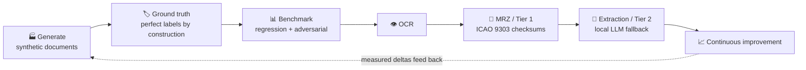

# VISION — SynthPass

> **Status:** foundational document. This file states *why* SynthPass exists and where it is
> going. It is deliberately declarative. Concrete milestones live in
> [`ROADMAP.md`](ROADMAP.md); brand and stewardship in [`BRANDING.md`](BRANDING.md); the v2
> technical design record in [`mlis_v2_0_0_preliminary_design.md`](mlis_v2_0_0_preliminary_design.md).
>
> House rule (inherited from [`ARCHITECTURE.md`](ARCHITECTURE.md)): say what is true, state
> limitations plainly, and do not oversell. Where this document describes capability that does
> not ship yet, it says so.

---

## 1. Philosophy

SynthPass is designed from first principles for **offline, deterministic, and air-gapped
operation**. This is not a deployment option bolted on for regulated customers — it is the
axis the entire architecture turns on, and every feature is measured against it.

The project began as an identity-document *extraction* appliance: an image goes in, structured
JSON comes out, with **zero cloud calls**. It validates documents deterministically via
**ICAO 9303 MRZ check digits** (Tier 1) and only falls back to a local, quantized LLM (Tier 2)
when no valid MRZ exists. Both stages run in-process — no Python, no sidecar, no container
required. That thesis is proven and shipping today.

SynthPass v2 widens the mission from *reading* documents to **owning the full document-AI
lifecycle**, and its centre of gravity is a single conviction:

> **VISION.** The scarce resource in identity-document AI is not models — it is *perfectly
> labelled data you are legally allowed to own*. Real specimens are rare, sensitive, and
> impossible to share. Synthetic, deterministic, checksum-valid documents are none of those
> things. Whoever owns the generator owns the ground truth, and whoever owns the ground truth
> owns the benchmark.

Two principles follow, and they are non-negotiable:

- **Deterministic before probabilistic.** Given the same seed and parameters, output is
  byte-identical. A checksum that can prove an answer always runs before a model that can only
  guess one. Reproducibility is a correctness property, not a convenience.
- **Air-gapped or it does not ship.** There are zero network calls in the processing path.
  Model and font fetches are explicit, checksum-verified bootstrap steps — never runtime
  behaviour. No telemetry. No model CDN at runtime. No exceptions.

Supporting invariants, already true in the codebase and treated as load-bearing:

- **One binary.** Everything in-process; the static `x86_64-unknown-linux-musl` build with
  models baked in is the reference artifact. New dependencies must be pure Rust or justify
  themselves in writing.
- **PII paranoia.** Every PII-bearing value is zeroized on drop; the audit trail is SHA-256
  only and never records field content.
- **Offline licensing.** Extraction is gated by an offline **Ed25519-signed license** — the
  mechanism for selling and metering the product without ever phoning home.

## 2. Long-Term Vision

The end state is not "better OCR". It is ownership of the complete loop:

Each stage is air-gapped, each hand-off is deterministic, and the labels that leave the
generator are the same labels the benchmark grades against — so accuracy claims come from a
harness, never from vibes.

Concretely, the long arc is:

1. **Own the generator.** A pure-Rust, MIT-licensed factory that emits labelled identity
   documents whose MRZs are **checksum-valid by construction**, with reproducible seeds and a
   modular degradation pipeline (mobile capture, flatbed scan, worn document, border-control
   kiosk).
2. **Own the benchmark.** Golden datasets, adversarial red-team generation, and a CI accuracy
   gate that blocks regressions — turning "is extraction still good?" from a judgement call
   into a build status.
3. **Own the extraction platform.** The v2 *Atlas* redesign — a versioned extraction schema
   with per-field confidence and provenance, OCR that detects regions by geometry instead of
   guessing, bounded concurrency and batch capacity, structured observability, enforced
   licensing tiers, and grammar-constrained decoding for the LLM fallback.
4. **Expand the surface.** TD1/TD2 and MRVA/MRVB formats, declarative document layouts,
   dataset exports (COCO / YOLO / JSONL / Hugging Face), and a plugin architecture.

> **Non-goals, permanently.** SynthPass crops a portrait region; it never *identifies* a
> person — no face recognition, no biometric matching, no liveness. It proves a faithful
> *read*; it does not judge document *authenticity* — forgery and tamper detection are out of
> scope. It does not do cloud anything. These lines do not move.

## 3. Commercial Positioning

> **COMMERCIAL.** SynthPass is a strategic enabler for *innovation under constraint*: it lets
> organisations use the power of synthetic identity data for AI/ML training, application
> testing, and benchmarking **without ever handling real PII** and **without a document
> leaving their security boundary**.

Target markets are those for whom data sovereignty is not optional:

- **Regulated industries** — finance, insurance, healthcare, KYC/onboarding vendors — who must
  test identity-verification systems but cannot legally pool real customer documents.
- **Government, defence, and border-control integrators** who require on-premises, air-gapped
  tooling as a baseline.
- **AI/ML teams** building or evaluating document-understanding models who need large volumes
  of perfectly labelled training and evaluation data.

The business model is tiered and detailed in [`BRANDING.md`](BRANDING.md): an open-source
Community edition drives adoption and contribution; a commercial Professional SDK and
Enterprise edition add capacity, support, certification, and custom-model services. The core
technology stays freely available; sustainability comes from the surfaces enterprises actually
pay for. The value proposition is not "a passport generator" — it is **testing, validation,
benchmarking, and AI infrastructure for identity documents**, and messaging is held to that
line deliberately.

## 4. Compliance Framework

Compliance is treated as a first-class mission, given equal weight to technical sovereignty —
not a marketing afterthought. The architecture *mechanically* supports the obligations, rather
than merely claiming alignment.

**GDPR (Regulation (EU) 2016/679).**

- **Data minimisation & no real PII.** Synthetic documents describe fictional identities
  generated from seeds; no real personal data is ingested to produce them. There is no lawful
  basis to worry about because there is no personal data.
- **No PII egress.** Air-gapped operation guarantees that if a real document *is* processed for
  extraction, no personally identifiable information ever leaves the controlled environment.
- **Purpose limitation & pseudonymisation.** Synthetic datasets are lawful stand-ins for real
  data in testing and development pipelines, removing a whole class of exposure.

**ISO/IEC 27001 (Information Security Management).** SynthPass is positioned as a *component
that helps organisations build compliant infrastructure*, supporting ISMS controls around
confidentiality (zeroize discipline, no egress), integrity (deterministic, checksum-verified
output; tamper-evident SHA-256 audit trail), and availability (single self-hostable binary,
no external runtime dependencies).

> **NOTE.** SynthPass is not itself "certified" against these frameworks, and this document does
> not claim that it is. What it claims — and what the architecture backs — is that the tool is
> *designed to make compliance easier to achieve and evidence*. Ethics guardrails in the
> generator (an unconditional synthetic watermark and a generic, non-country template) are part
> of that posture: the output is unmistakably synthetic by construction.

---

*SynthPass is an open-source project under the Identra stewardship. See
[`BRANDING.md`](BRANDING.md) for trademark and attribution guidance.*
